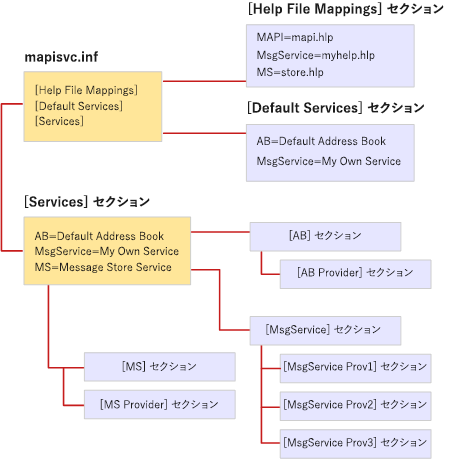

# MapiSvc.inf ファイルの形式

**適用されます**: Outlook 
  
MapiSvc.inf ファイルは、MAPI メッセージ サービスの構成情報を中央のデータベースとして機能します。 MapiSvc.inf には、各ワークステーション、各メッセージのサービスに属しているサービス プロバイダーに関する情報と、MAPI サブシステムについての情報にインストールされているメッセージ サービスに関する情報が含まれています。 MapiSvc.inf は、プロファイルの情報のプライマリ ソースです。 新しいプロファイルのビルド時または既存の変更、メッセージ サービスごとに関連する情報またはサービス ・ プロバイダーは、MapiSvc.inf からコピーします。 
  
MapiSvc.inf は、階層リンクのセクションに分かれています。
  
1. セクションのすべてのプロファイルに適用される情報が含まれています。 このセクションでは、3 つの部分があります。
    
   - **[サービス]** セクションで、サービスのセクションの以降のメッセージへのリンクを提供します。 
    
   - **[ヘルプ ファイルのマッピング]** セクションに関する情報が含まれています。HLP ファイルがメッセージ サービスによって提供されます。 
    
   - **[既定のサービス]** セクションで、既定のインストールを構成するメッセージ サービスを一覧表示します。 
    
2. 個々 のメッセージ サービスに適用される情報が含まれているセクションです。 これらのセクション内のエントリは、その後のサービス ・ プロバイダーのセクションへのリンクを提供します。
    
3. メッセージ サービス内の個々 のサービス プロバイダーに適用される情報が含まれているセクションです。
    
次の図は、典型的な MapiSvc.inf ファイルの構成を示します。 3 つのメッセージ サービスがある: AB、MsgService、および MS です。 メッセージ サービスごとに、等号の右側の名前は、サービスの表示名です。 各メッセージ サービスは、独自のセクションを他の場所には 1 つまたは複数のサービス プロバイダーのセクションにリンクされているファイルに。 メッセージ サービスに属しているすべてのサービス プロバイダーの 1 つのサービス プロバイダー] セクションがあります。 AB と MS メッセージ サービスは、3 つのサービス プロバイダーは、MsgService サービスに属しているが、1 つのプロバイダー サービスです。
  
**MapiSvc.inf ファイルの編成**
  

  
MAPI には、MAPI サブシステムのエントリが含まれている MapiSvc.inf ファイルのスケルトン バージョンが用意されています。 各メッセージ サービスの実装側は、サービスとそのサービスに属しているサービス ・ プロバイダーの両方に該当するエントリを追加します。 一部のエントリは必要です。 たとえば、MAPI は、メッセージ サービスの名前とそれぞれのサービス ・ プロバイダーのパスを指定することが必要です。 この情報は、読み込みができなくなります。
  
メッセージ サービス、またはサービスのプロバイダー セクションには、どちらかのセクションで必須およびオプションの情報を追加できます。 メッセージ サービスを記述する情報の格納先とは、サービスのサービス プロバイダーの数によって異なります。 この情報は、サービスの各サービス ・ プロバイダーに適用するため行う必要があります、すべてのプロバイダーにアクセスできるようにします。 [メッセージ サービス] セクションで、[優先] オプション、またはすべてのサービス プロバイダー セクションでは、それを格納します。 不要なレプリケーション、複数のコピーを保持する必要性を回避するには、同期後は、情報を格納します。
  
メッセージ サービスが 1 つのプロバイダーのサービスの場合は、サービスのセクションではなく、サービス ・ プロバイダーについては、「メッセージ サービス情報をすべて保存します。 サービス プロバイダー] セクションにアクセスする、高速化とメッセージの [サービス] セクションにアクセスするよりもより直接的です。 
  
MapiSvc.inf ファイルの公開の構成データだけを格納します。 プライベートまたは保護を強化するなど、パスワードやその他の資格情報を必要とする情報は必要がありますこのファイルには含まれません。 代わりに、しないように選択するか、すべてのこのタイプの情報を格納またはセキュリティで保護されたプロパティとプロファイルに保管する必要です。 セキュリティで保護されたプロパティには、暗号化などの組み込みの保護機能があります。
  

