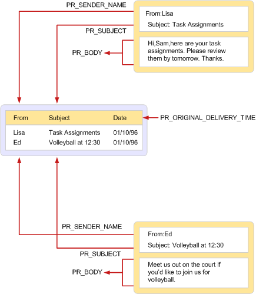

# MAPI テーブル
  
**適用されます**: Outlook 2013 |Outlook 2016 
  
MAPI テーブルは、特定の種類の場合は、その他の MAPI オブジェクトに属するプロパティのコレクションを表示するために使用される MAPI オブジェクトです。 MAPI テーブルは、オブジェクトとオブジェクトのプロパティを表す各列を表すすべての行と行と列の形式で構成されています。 **PR_ENTRYID** ([PidTagEntryId](pidtagentryid-canonical-property.md)) のプロパティを開き、オブジェクトを変更するために使用する識別子は、通常それぞれの行に含まれるプロパティの 1 つ。 
  
行にプロパティの値が含まれているために、テーブルから行を取得するは行を表すオブジェクトから直接プロパティのセットを取得するのに似ています。 両方の操作と、プロパティ値の配列を取得します。 長い文字列やバイナリのプロパティの処理では、主な違いです。 テーブルに含めることは、いくつかのテーブルの実装には、255 バイトにこれらのプロパティが切り捨てられます。 オブジェクトから直接取得する場合、完全な値は常に利用可能です
  
テーブルは、テーブル内のオブジェクトの種類によって、MAPI、アドレス帳、メッセージ ストア プロバイダーによって実装されます。 メッセージ ストア プロバイダーは、フォルダーとフォルダー内のメッセージに関する情報が含まれていますが、各フォルダーの内容テーブルを実装します。 アドレス帳プロバイダーでは、アドレス帳コンテナーと組織を表示する階層テーブルを実装します。 MAPI は、両方で、異なる複数のテーブル、クライアント アプリケーションによって使用されるいくつか、サービス ・ プロバイダーが使用するいくつか、使用するためのいくつかを実装します。 状態テーブルは、MAPI テーブルを最終的に提供する、MAPI 以外のサービス プロバイダーのすべての種類から成り立っています、行に一意です。 
  
MAPI では次の図は、テーブルの頻繁に使用されるのいずれか: フォルダーの内容を表示します。 右側には、2 つのメッセージの表示は一般的なメッセージング クライアント アプリケーションで表示される場合があります。 表示には、4 つ各メッセージに関する情報にはが含まれています: 送信者、受信者、件名、およびメッセージのテキストです。 個々 の情報は、メッセージのプロパティに対応します。
  
左側に、これら 2 つのメッセージを含んでいる内容のテーブルのビューです。 コンテンツ テーブルは、フォルダーには、多くの 4 つ以上の列を含む行の 10 個のメッセージであるために、10 行可能性がありますこの特定のビューは 2 つの行と列の 3 つに制限します。
  
次の表は、テーブル ビューの列セットを構成するプロパティを示します。
  
|**プロパティ**|**説明**|
|:-----|:-----|
|**PR_SENDER_NAME**([PidTagSenderName](pidtagsendername-canonical-property.md))    |送信者名    |
|**PR_ORIGINAL_DELIVERY_TIME**([PidTagOriginalDeliveryTime](pidtagoriginaldeliverytime-canonical-property.md))    |日付と時刻のメッセージが送信されました    |
|**あるの PR_SUBJECT**([PidTagSubject](pidtagsubject-canonical-property.md))    |メッセージの件名行    |
   
メッセージに表示されるプロパティのセットをテーブルに表示される列のセットと同じことを確認します。 テーブルの実装者は、ここでは、メッセージ ・ ストア プロバイダー、既定の順序で列の既定の設定は装置です。 クライアントでは、追加の列を要求するか、既定を拒否することは、この列のセットを変更でき、特定の方法で注文することを確認することができます。 クライアントも注文できます、行、1 つまたは複数の列の値に基づいて並べ替えること。
  
**テーブルを使用してフォルダーの内容を表示**
  

  
テーブルを操作するための 2 つのインターフェイスがあります。
  
- [IMAPITable: IUnknown](imapitableiunknown.md)読み取り専用ビューを表示してプレゼンテーションのみを変更できるようになり、テーブルの基になるデータのクライアントとサービス ・ プロバイダーを提供します。 **IMAPITable**と同時に同じデータを複数のユーザーにアクセスできます。 **IMAPITable**は、MAPI とサービス ・ プロバイダーによって実装されます。 
    
- [ITableData: IUnknown](itabledataiunknown.md)では、クライアントとサービス ・ プロバイダーに読み取り/書き込みアクセス、テーブルの基になるデータでは、永続的な変更を加えるようにします。 **IMAPITable**は MAPI によって実装されているし、 [CreateTable](createtable.md)関数を呼び出すことによってアクセスしているサービス プロバイダーによって主に使用します。 **ITableData**の実装を保持するテーブルのすべてのデータと関連付けられているいずれかの不適切なので、メモリに制限が非常に大きなテーブルを使用します。 複合の制限や分類などの複雑な操作はサポートされていません。 
    
## 関連項目

- [MAPI の概念](mapi-concepts.md)

