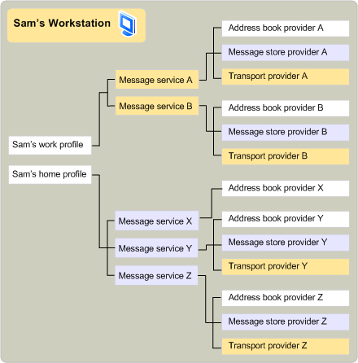

# メッセージ サービスとプロファイル
  
**適用対象**: Outlook 2013 | Outlook 2016 
  
一部のユーザーは、1つ以上のサービスプロバイダーを備えた複数のメッセージングシステムのサービスを必要とします。 各サービスプロバイダーを個別にインストールして構成するのは煩雑なため、メッセージングサーバーでは通常、すべての機能を公開するために関連するプロバイダーのグループが必要になるため、MAPI にはメッセージサービスの概念が含まれています。 メッセージサービスは、ユーザーがサービスプロバイダーをインストールして構成する際に役立ちます。
  
メッセージサービスを作成するために、開発者は、サービスの各プロバイダーの構成を処理するためのメッセージサービスエントリポイントプログラムと、次の操作を行うセットアッププログラムを記述します。
  
- サービスに各プロバイダーをインストールします。
    
- レジストリおよび初期化ファイルのエントリを作成します。
    
- MAPI 構成ファイル mapisvc.inf にエントリを作成します。
    
mapisvc.inf ファイルには、コンピューターにインストールされているすべてのメッセージサービスおよびサービスプロバイダーの構成に関連する情報が含まれています。 階層構造のセクションで構成され、各レベルは次のようにリンクされています。 上部には、次のものを含む3つのセクションがあります。 
  
- メッセージサービスのヘルプファイルの一覧。
    
- 最も重要な、または既定のメッセージサービスのリスト。
    
- コンピューター上のすべてのサービスのリスト。
    
次のレベルには、各メッセージサービスのセクションが含まれ、最後のレベルにはサービスの各サービスプロバイダーのセクションが含まれています。 MAPI では、サービスプロバイダーとメッセージサービスの開発者が mapisvc.inf に特定のエントリを追加する必要があります。開発者は、自分の裁量で他のエントリを追加できます。 mapisvc.inf の情報のほとんどは、1つ以上のプロファイルで構成されています。これは、ユーザーが指定した一連のメッセージサービスの構成情報の集合です。 コンピューターは複数のユーザーを持つことができ、1人のユーザーが複数のユーザー設定を持つことができるため、コンピューター上には多くのプロファイルが存在できます。 各プロファイルは、異なるメッセージサービスのセットを記述します。 複数のプロファイルを持つことで、ユーザーは、たとえば1組のメッセージサービスとオフィスで異なるセットを使用して、自宅で作業することができます。
  
プロファイルは、構成サポートを提供するクライアントアプリケーションによって、メッセージサービスのインストール時またはログオン時に作成されます。 MAPI には、コントロールパネルアイテムとプロファイルウィザードという2つのクライアントアプリケーションが用意されています。 コントロールパネルの項目は、ユーザーがプロファイルの作成、削除、編集、コピー、およびプロファイル内のエントリの変更を行うことができる、完全なサービス構成アプリケーションです。 プロファイルウィザードは、メッセージサービスを可能な限り簡単にプロファイルに追加できるように設計された単純なアプリケーションです。 プロファイルウィザードは、"プロパティページ" と呼ばれる一連のダイアログボックスで構成されており、ユーザーにサービスのインストールと構成のプロセスを促します。 ユーザーには、最も重要な設定の値のみが表示されます。他のすべての設定は既定値を継承します。 プロファイルが作成されると、ユーザーは変更を行うことができなくなります。 
  
コントロールパネルの項目は常にコントロールパネルから呼び出されますが、プロファイルウィザードを呼び出す可能性があるさまざまなシナリオがあります。 クライアントアプリケーションは、プロファイルウィザードを呼び出して、ログオン時に、まだ作成されていない既定のプロファイルを作成できます。 コードを再実装してプロファイルを追加するのではなく、コントロールパネルのアイテムまたは他のクライアントアプリケーションがプロファイルウィザードで既に使用されている機能に依存していることがあります。 そのエントリポイント関数のメッセージサービスは、サービスを既定のプロファイルに追加する必要がある場合に、プロファイルウィザードを呼び出すことができます。 プロファイルウィザードを使用するメッセージサービスは、付加的なエントリポイント関数と Windows の標準ダイアログボックスプロシージャを記述する必要があります。 プロファイルウィザードは、このダイアログボックスが使用されている場合に生成されるメッセージをダイアログボックスプロシージャが処理する一方で、サービスの構成ダイアログボックスを取得するエントリポイント関数を呼び出します。 
  
プロファイルは、mapisvc.inf ファイルと同様の方法で整理されています。 プロファイルは階層構造のセクションをリンクしています。サービスプロバイダーは、最下位レベルのセクション、メッセージサービス独自のセクション、中間レベルのセクション、MAPI は最上位レベルのセクションを所有します。 各セクションは、 [MAPIUID](mapiuid.md)と呼ばれる一意の識別子で識別されます。 mapi セクションには、すべてのメッセージサービスプロファイルセクションの識別子、その他の各セクションへのリンクなど、mapi の内部情報が含まれています。 各メッセージサービスセクションには、プロバイダーセクションへのリンクが格納されています。各プロバイダーセクションには、そのサービスセクションへのリンクが格納されています。 
  
次の図は、2つの一般的なプロファイルの内容を示しています。 Sam には、自分のコンピューターに2つのプロファイルがあり、1つは自宅用で、もう1つは office 用です。 ホームプロファイルには3つのメッセージサービスが含まれています。 Message Service X は、アドレス帳管理用の単一のプロバイダーサービスです。 メッセージサービス Y および Z には、アドレス帳プロバイダー、メッセージストアプロバイダー、トランスポートプロバイダーという3つのプロバイダーがあります。 Sam の作業プロファイルには2つの異なるメッセージサービスが含まれており、それぞれにアドレス帳プロバイダー、メッセージストアプロバイダー、トランスポートプロバイダーがあります。 
  
**プロファイルの例**
  

  
次の図は、2つのメッセージサービスを含むプロファイルを示しています。 メッセージサービスに属するサービスプロバイダーをインストールして構成するためのコードは、プロバイダーのコードと同じ DLL に格納されます。 このコードでは、ログオン時にプロファイルから情報を読み取り、サービスプロバイダーを構成します。また、必要であれば、不足している情報についてユーザーに確認します。 プロバイダーの構成設定を表示または変更するクライアントからの要求も、この共通コードによって処理されます。
  
**サービス プロバイダーのインストールおよび構成**
  
![サービスプロバイダーをインストールおよび構成]する(media/amapi_55.gif "サービスプロバイダーをインストールおよび構成")する
  
## 関連項目

- [MAPIUID](mapiuid.md)
- [MAPI �v���O���~���O�̊T�v](mapi-programming-overview.md)

