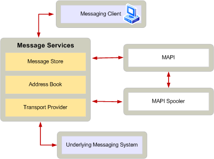

# MAPI サブシステムでのトランスポート プロバイダーの役割Transport provider role in the MAPI subsystem
  
**適用対象**: Outlook 2013 | Outlook 2016**Applies to**: Outlook 2013 | Outlook 2016 
  
トランスポート プロバイダーの動的リンク ライブラリ (DLL) は、MAPI スプーラーとメッセージの送受信を担当するメッセージング システムの一部との間のインターフェイスを提供します。Transport provider dynamic-link libraries (DLLs) provide the interface between the MAPI spooler and the part of a messaging system responsible for message sending and receiving. MAPI スプーラーとトランスポート プロバイダーは、メッセージの送信またはメッセージの受信の責任を処理するために一緒に作業します。The MAPI spooler and the transport provider work together to handle the responsibilities of sending a message or receiving a message. MAPI スプーラーは、トランスポート プロバイダー DLL を最初に使用するときに読み込み、不要になったときに解放します。The MAPI spooler loads the transport provider DLL when it is first used and releases it when it is no longer needed. 複数のトランスポート プロバイダーを同じシステムにインストールできますが、MAPI は必要なスプーラーを 1 つ提供します。Multiple transport providers can be installed on the same system, but MAPI supplies the one spooler required.
  
通常、クライアント アプリケーションはトランスポート プロバイダーと直接通信しない。Client applications do not typically communicate directly with the transport provider. クライアントはストア プロバイダーを介してメッセージを送信し、MAPI スプーラーは送信メッセージを適切なトランスポート プロバイダーに送信し、受信メッセージを適切なメッセージ ストアに配信します。Rather, clients submit messages through a store provider and the MAPI spooler sends outgoing messages to the appropriate transport provider and delivers incoming messages to the appropriate message store. MAPI スプーラーは、その作業を実行し、フォアグラウンド アプリケーションがアイドル状態のときにトランスポート プロバイダーへの呼び出しを行います。The MAPI spooler does its work and makes its calls to transport providers when foreground applications are idle. 必要に応じて、トランスポート プロバイダーが最初にログオンするときにダイアログ ボックスを表示した後、送信キューと受信キューをフラッシュするためにクライアントから呼び出されない限り、トランスポート プロバイダーはバックグラウンドで動作します。After optionally displaying dialog boxes when the transport provider is first logged on, transport providers operate in the background unless called by the client to flush send and receive queues. 
  
トランスポート プロバイダーは、MAPI メッセージング システムで次の責任を負います。Transport providers have the following responsibilities in a MAPI messaging system:
  
- MAPI スプーラーがメッセージの宛先アドレスに応じて適切なトランスポート プロバイダーにメッセージを送信できるよう、MAPI スプーラーで受け入れ可能なアドレスの種類を登録します。Register the address types they can accept with the MAPI spooler so the MAPI spooler can submit messages to the appropriate transport provider depending on the destination address of the messages. 1 つのトランスポート プロバイダーは、複数のアドレスの種類を登録できます。One transport provider can register more than one address type. トランスポート プロバイダーは、MAPI スプーラーに特定の受信者のアドレスを登録することもできます。Transport providers can also register specific recipients' addresses with the MAPI spooler. これらのアドレスの 1 つにアドレス指定されたメッセージは、MAPI スプーラーにアドレスを登録したトランスポート プロバイダーに送信されます。Messages addressed to one of these addresses will be submitted to the transport provider that registered the address with the MAPI spooler. 詳細については、「トランスポート プロバイダー [と MAPI スプーラー運用モデル」を参照してください](transport-provider-and-mapi-spooler-operational-model.md)。For more information, see [Transport Provider and MAPI Spooler Operational Model](transport-provider-and-mapi-spooler-operational-model.md).
    
- MAPI スプーラーに受信メッセージを配信します。Deliver incoming messages to the MAPI spooler. メッセージング システムの性質に応じて、トランスポート プロバイダーは、新しいメッセージが到着すると MAPI スプーラーに直接通知するか、MAPI スプーラーがトランスポート プロバイダーを定期的にポーリングして新しいメッセージを確認する要求を行います。Depending on the nature of the messaging system, a transport provider can either directly notify the MAPI spooler when a new message arrives, or it can request that the MAPI spooler poll the transport provider periodically to check for new messages.
    
- MAPI メッセージ のプロパティを、メッセージング システムにネイティブなメッセージ プロパティに変換します。Convert MAPI message properties to and from message properties native to the messaging system. たとえば、トランスポート プロバイダーは、送信メッセージ内の送信者と受信者のアドレスを、メッセージング システムで受け入れられるフォームに変換する必要があります。For example, the transport provider might have to convert the sender's and recipient's addresses in an outgoing message to a form that is acceptable to the messaging system. 一部のメッセージング システムでは、すべての MAPI メッセージ プロパティがサポートされていません。Some messaging systems do not support all of the MAPI message properties. メッセージング システムにメッセージを配信するときに MAPI メッセージのプロパティを保持する方法の詳細については、「メッセージ トランスポート プロバイダーの開発TNEF-Enabled [参照してください](developing-a-tnef-enabled-transport-provider.md)。For more information about preserving MAPI message properties when delivering messages to a messaging system, see [Developing a TNEF-Enabled Transport Provider](developing-a-tnef-enabled-transport-provider.md).
    
- トランスポート プロバイダーに固有のメッセージと受信者のオプションを登録します。Register message and recipient options specific to the transport provider.
    
- メッセージング システムで必要な資格情報の検証を実行します。Perform any verification of credentials required by the messaging system.
    
- MAPI スプーラーによって渡されたメッセージ オブジェクトを使用して、送信メッセージにアクセスします。Access outbound messages using the message object passed to it by the MAPI spooler.
    
- 基になるメッセージング システムで必要に応じてメッセージ形式を変換します。Translate message format as required by the underlying messaging system.
    
- これらの受信者の **PR_RESPONSIBILITY** ([PidTagResponsibility](pidtagresponsibility-canonical-property.md)) プロパティを設定して、トランスポート プロバイダーが処理の責任を受け入れる送信メッセージの受信者を MAPI スプーラーに通知します。Notify the MAPI spooler which recipients of an outgoing message the transport provider has accepted responsibility for handling by setting the **PR_RESPONSIBILITY** ([PidTagResponsibility](pidtagresponsibility-canonical-property.md)) property for those recipients.
    
- 受信メッセージを処理する必要がある場合は、MAPI スプーラーに通知します。Inform the MAPI spooler when an incoming message needs to be handled.
    
- メッセージ オブジェクトを使用して、受信メッセージ データを MAPI スプーラーに渡します。Pass incoming message data to the MAPI spooler by using message objects.
    
- 受信メッセージに必要なすべての MAPI メッセージ プロパティに値を割り当てる。Assign values to all required MAPI message properties on incoming messages.
    
- 必要に応じて、配信後に基になるメッセージング システムからメッセージを削除します。Delete the message from the underlying messaging system after delivery, if necessary.
    
- MAPI スプーラーとクライアント アプリケーションの状態情報を提供します。Provide status information for the MAPI spooler and client applications.
    
次の図は、MAPI アーキテクチャの他のコンポーネントに関するトランスポート プロバイダーの役割を示しています。The following illustration shows a transport provider's role with respect to the other components of the MAPI architecture.
  
**メッセージング システムのトランスポート プロバイダー ロール****Transport provider role in a messaging system**
  
![メッセージング システムのトランスポート プロバイダーの役割]メッセージング システム(media/xp01.gif "内のトランスポート プロバイダーの役割")
  

