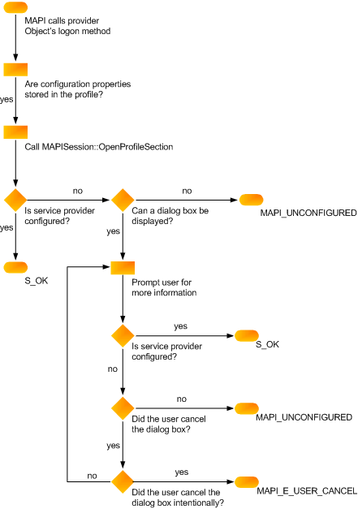

# サービス プロバイダー構成の検証
  
**適用対象**: Outlook 2013 | Outlook 2016 
  
ログオン方法[(IABProvider::Logon、IMSProvider::Logon、](iabprovider-logon.md)[または IXPProvider::TransportLogon)](ixpprovider-transportlogon.md)は、プロバイダーの構成を確認する必要があります。  これには、完全な操作に必要なすべてのプロパティが正しく設定されていることを確認する必要があります。 プロバイダーごとに異なる数のプロパティが必要です。構成は、プロバイダーと、許可するユーザー操作の程度によって異なります。 一部のサービス プロバイダーは、プロファイルに必要なすべてのプロパティを保持します。 

他のサービス プロバイダーは、プロファイル内のプロパティの部分的なセットを保持し、不足している値をユーザーに求めるメッセージを表示します。 それでも他のプロバイダーは、構成に必要なすべての情報を提供するためにユーザーに依存して、プロファイルにプロパティを保存する必要があります。
  
### プロファイルに格納されているプロパティを取得するには
  
1. [IMAPISupport::OpenProfileSection](imapisupport-openprofilesection.md)を呼び出し、プロバイダーの[MAPIUID](mapiuid.md)を入力パラメーターとして渡します。 
    
2. プロファイル セクションの [IMAPIProp::GetProps](imapiprop-getprops.md) または [IMAPIProp::GetPropList](imapiprop-getproplist.md) メソッドを呼び出して、個々のプロパティまたはプロパティ リストを取得します。 
    
### ユーザー情報からプロパティを設定するには
  
MAPI が表示を禁止するフラグを設定していない場合は、プロパティ シートを表示します。 次のフラグは、ユーザー インターフェイスを表示できないことを示しています。
  
|**Flag**|**サービス プロバイダー**|
|:-----|:-----|
|AB_NO_DIALOG    |アドレス帳プロバイダー    |
|LOGON_NO_DIALOG    |トランスポート プロバイダー    |
|MDB_NO_DIALOG    |メッセージ ストア プロバイダー    |
   
プロバイダーがプロファイル内のすべての構成プロパティを保存せず、ユーザーの操作が必要で、MAPI がダイアログ ボックスの抑制フラグの 1 つをログオン メソッドに渡す場合は、MAPI_E_UNCONFIGURED を返します。 ダイアログ抑制フラグが設定されていないが、ユーザーが必要な情報の一部を提供していない場合も、このエラーを返します。
  
サービス プロバイダーがログオン メソッドに失敗すると、MAPI_E_UNCONFIGURED MAPI はエントリ ポイント関数を再度呼び出します。 2 番目の呼び出しで情報を見つけできない場合は、サービス プロバイダーの重要な内容に応じてセッションが終了する可能性があります。 
  
次の図は、サービス プロバイダーのログオン方法の構成に必要なロジックを示しています。 
  
**構成検証のフローチャート**
  

  
## 関連項目

- [サービス プロバイダー ログオンの実装](implementing-service-provider-logon.md)

