# Outlook 用のソリューションを開発するための API またはテクノロジの選択

この記事では Outlook 2013 および Outlook 2016 を拡張するために使用できる API とテクノロジについて説明しており、各自のシナリオに適した API またはテクノロジを判断する際に役立てることができます。
  
Microsoft は、Outlook を拡張するさまざまな API とテクノロジをサポートしています。 
  
- Office 2013 以降、Office プラットフォーム用アプリにより、デスクトップ、タブレット、スマートフォンで動作するすべての Outlook クライアントで Outlook の機能を拡張することが可能になりました。Office プラットフォームには、JavaScript API for Office とアプリ マニフェストのスキーマが含まれます。
    
- オブジェクト モデル、それに対応する Outlook プライマリ相互運用機能アセンブリ (PIA)、メッセージング API (MAPI) が、Outlook ソリューションで最もよく用いられる API です。
    
- 補助 API は、一部のシナリオで MAPI を補完します。
    
- Outlook Social Connector (OSC) プロバイダー拡張機能と天気予報バー拡張機能は、ニッチ マーケットの特定のシナリオで役立ちます。
    
この記事では、Office アドイン プラットフォーム、オブジェクト モデル、PIA、MAPI の選択基準について説明します。 Office アドインは、JavaScript API for Office を使用する場合にオブジェクト モデルを呼び出すことはなく、その逆も起こらないことに注意してください。他の API を使用するソリューションでは、1 つ以上の API が使用されることがあります。たとえば、C++ で作成された COM アドインは、同じソリューション内でオブジェクト モデル、MAPI、および補助 API を使用することがあります。
  
この記事を最大限活用するには、ユーザー レベルで Outlook に精通しており、一般的なソフトウェア開発の知識を持っている必要があります。しかし、前述の API やテクノロジがサポートする機能を広範囲に理解している必要はありません。この記事から次の質問の答えが得られます。
  
- 自分が開発するソリューションの目標、ターゲットにするマーケット、利用可能なリソースについてのアイデアだけがある場合、他のどのような基準を検討して API を選択する必要があるか。
    
- どのような理由で Office アドイン を検討することになるのか、またどのような場合にアドインではなくアプリの作成を選択するか。
    
- ソリューションを古いバージョンの Outlook (Outlook 2003 を含む) で実行しなければならない場合、そのことが API の選択にどのように影響するか。
    
- ソリューションが何千ものアイテムを含む Outlook フォルダーを反復処理しなければならず、それらのアイテムを変更することもできなければならない場合、どの API が最適か。
    
- ソリューションが Outlook ビジネス ロジックに大きく依存しており、かつ他の Office アプリケーションとも対話する場合、Outlook オブジェクト モデルを選択することが最善か。
    
- オブジェクト モデルと MAPI を使用することにより、Outlook をどのように拡張できるか。
    
- タスクの実行にオブジェクト モデルと MAPI のいずれかを使用できる場合、使用する API をどのように決定するか?

## 目標評価基準

このセクションでは、Office アドイン プラットフォーム、オブジェクト モデル、PIA、MAPI を比較してどれがより良く要件を満たすのか判断する際に使用する基準について説明します。プロジェクトや使用可能なリソースによって、各種基準の重要度は異なります。
  
このセクションの表では、評価基準を次の分類に分けて定義しています。
  
- 機能上の基準テクノロジを使用して行えることと行えないことを説明します。
    
- 開発上の基準テクノロジの使用に必要な開発ツールまたは情報について説明します。
    
- セキュリティ上の基準テクノロジに関係するセキュリティおよびアクセス許可の問題について説明します。
    
- 展開上の基準テクノロジに対して推奨される展開および配布メソッドについて説明します。

### Office プラットフォーム用アプリの目標評価基準

Office 2013 以降、開発者は Office アドイン プラットフォームを使用して Web サービスとコンテンツを Office のリッチ クライアントと Web クライアントのコンテキストに拡張することができます。Office アドイン は、一般的な Web テクノロジを使用して開発され、(Outlook などの) Office クライアント アプリケーション内部でホストされる Web ページで、 社内またはクラウドで実行できます。Office アドイン の中でも、Outlook がサポートするタイプはメール アプリといいます。Outlook をアプリケーション レベルで自動化するためにオブジェクト モデル、PIA、MAPI をよく使用しますが、JavaScript API for Office を使用してアイテム レベルで電子メール メッセージ、会議出席依頼、予定の内容やプロパティを連動させることもできます。メール アプリは Office ストア や社内の Exchange カタログに公開できます。 
  
エンド ユーザーや管理者はメール アプリを Exchange メールボックスにインストールすれば、Outlook リッチ クライアントや Outlook Web App でもメール アプリを使用できます。 開発者であれば、自分のメール アプリをデスクトップでのみ利用可能にしたり、タブレットやスマートフォンでも利用可能にしたりすることもできます。図 1 に、[方法: YouTube ビデオを表示するための Outlook 2013 プレビュー用メール アプリを構築する方法](https://code.msdn.microsoft.com/office/Mail-apps-for-Outlook-01c9248f)で詳しく説明されている YouTube メール アプリの例を示します。YouTube メール アプリにより、エンド ユーザーは YouTube の URL を選択して、デスクトップやタブレットの Outlook または Outlook Web App 内でビデオを見ることができます。
  
**図 1. 選択したメッセージには YouTube.com のビデオの URL が含まれていて、このメッセージに対して YouTube メール アプリがアクティブになっている**

  
ユーザーがメール アプリをインストールすると、そのときのコンテキストがアプリの指定するアクティブ化条件と一致した場合、アプリ バーでアプリが使用可能になります。メール アプリでは、そのときに選択されているアイテムに関して、特定の条件と一致するときにのみメール アプリをアクティブにするルールを指定することができます。たとえば、選択した Outlook アイテムに YouTube.com のビデオの URL が含まれているときにのみ Outlook 内で YouTube ビデオを再生できるようにする YouTube メール アプリがその一例です。この場合、選択したメッセージに先のような URL が含まれている場合にのみ、アプリがアクティブになるように指定します。
  
次の表は、Office アドイン プラットフォームの評価基準を示しています。
  
#### 機能上の基準

|**基準**|**Office プラットフォーム用のアプリでのメール アプリのサポート**|
|:-----|:-----|
|アプリケーション ドメイン    |メール アプリのアクティビティの対象範囲は、ユーザーが選択しておりかつアクティブ化条件と一致する、ユーザーの Exchange メールボックス内にあるサポートされている、実質的にすべてのメッセージまたは予定アイテムです。メール アプリのアクセス許可によって、アイテムに存在するプロパティおよび特定のエンティティ (電子メール アドレスや電話番号など) に対してどのようなアクセスが行えるか判断されます。たとえば、 **メールボックスの読み取り/書き込み** アクセス許可を要求するメール アプリは、ユーザーのメールボックスにあるすべてのアイテムのすべてのプロパティに対して読み取りおよび書き込みを行い、すべてのフォルダーまたはアイテムに対して作成、読み取り、書き込みを行い、そのメールボックスからアイテムを送信できます。    |
|主要オブジェクト    |JavaScript API for Office は、Office アドイン のすべてのタイプで共有される最上位の少数のオブジェクト [Office](https://msdn.microsoft.com/library/c490b13d-ee52-4291-af5d-f4a5a11d3af0%28Office.15%29.aspx)、[Context](https://msdn.microsoft.com/library/662883d5-b86f-4bdc-99f0-9ee9129ed16c%28Office.15%29.aspx)、および [AysncResult](https://msdn.microsoft.com/library/540c114f-0398-425c-baf3-7363f2f6bc47%28Office.15%29.aspx) を提供します。その次のレベルの、メール アプリに関連する固有の API には、 [Mailbox](https://msdn.microsoft.com/library/a3880d3b-8a09-4cf9-9274-f2682cb3b769%28Office.15%29.aspx)、[Item](https://msdn.microsoft.com/library/ad288df1-3ca2-474c-bea4-c51f46e6fc43%28Office.15%29.aspx)、[UserProfile](https://msdn.microsoft.com/library/6d0a36ec-0d5c-40e3-9f6f-9a7fcf0ac3d8%28Office.15%29.aspx) オブジェクトが含まれ、これらはユーザーおよびユーザーのメールボックスで選択されているアイテムに関する情報へのアクセスをサポートします。データ レベルでは、 [CustomProperties](https://msdn.microsoft.com/library/95a69bd6-c4dc-429a-8b27-e2b68f74f3e3%28Office.15%29.aspx) および [RoamingSettings](https://msdn.microsoft.com/library/cf21bb08-7274-4ad6-ae9e-b2c12f92abc9%28Office.15%29.aspx) オブジェクトがそれぞれ、選択したアイテムおよびユーザーのメールボックスに対してメール アプリが設定したプロパティの保持をサポートします。アイテム レベルのオブジェクトには、 [Item](https://msdn.microsoft.com/library/08ebffff-eb52-4e21-9d4e-8f79e426f992%28Office.15%29.aspx) を継承する [Appointment](https://msdn.microsoft.com/library/909ad9eb-a1bc-4caa-b51e-fd59a02b9569%28Office.15%29.aspx) オブジェクトと **Message** オブジェクト、および [Message](https://msdn.microsoft.com/library/c658fa3d-1138-4a67-9a4b-c9edd11f8385%28Office.15%29.aspx) を継承する **MeetingRequest** オブジェクトが含まれます。 これらはメール アプリをサポートする、予定や会議などの予定表アイテムや、電子メール メッセージ、会議出席依頼、応答、取り消しなどのメッセージ アイテムといった Outlook アイテムのタイプを表します。API でこのレベルを超えるものには、 特定の既知の [Entities](https://msdn.microsoft.com/library/ffa6812c-34b8-4b0a-8f92-22c3580c8379%28Office.15%29.aspx) オブジェクト ( [Contact](https://msdn.microsoft.com/library/1a06c8d1-dafe-46f4-967e-dd9b1d5b20e9%28Office.15%29.aspx)、[MeetingSuggestion](https://msdn.microsoft.com/library/2604b44c-7b79-47f0-ac3e-7d99bc9e6751%28Office.15%29.aspx)、[PhoneNumber](https://msdn.microsoft.com/library/9726fbff-0f4f-4b70-8deb-effc14607d4e%28Office.15%29.aspx)、および [TaskSuggestion](https://msdn.microsoft.com/library/cc86426a-2730-4774-9067-0611e5c8e9c1%28Office.15%29.aspx) など) をサポートするオブジェクトやプロパティだけでなく、アイテム レベルのプロパティ ( [Appointment.subject](https://msdn.microsoft.com/library/16b0c3d6-adf4-4a88-ad09-4bb5565816b1%28Office.15%29.aspx) など) もあります。    メール アプリ用にサポートされている機能の要約については、「[Outlook 2013 プレビュー用メール アプリの開発の基本](https://msdn.microsoft.com/library/2cd5641b-492b-4431-8388-7fc589163e9c%28Office.15%29.aspx)」を参照してください。    |
|データ アクセス モデル    |JavaScript API for Office は、アプリの実行時環境、ユーザーのメールボックスおよびプロファイル、アイテムに関するデータの機能を階層的なオブジェクトの集合として表します。    |
|スレッド モデル    |各メール アプリは、Outlook プロセスとは別の独自のプロセスで実行されます。    |
|アプリケーション アーキテクチャ    |Outlook において、メール アプリは Web ブラウザー コントロール内部の別個のプロセスとしてホストされる HTML と JavaScript の Web ページの集まりであり、Web ブラウザー コントロールはセキュリティとパフォーマンス分離を提供するアプリ ランタイム プロセス内部でホストされます。    |
|リモート使用    |メール アプリは JavaScript API for Office を使用して、通信する Exchange Server に保管されている現在のユーザー、メールボックス、選択したアイテムに関するデータにアクセスします。メール アプリには適切なアクセス許可が付与されており、クロス ドメイン アクセスに適した方法を使用するなら、メール アプリは Exchange Web Services および他のサード パーティ Web サービスを呼び出して機能を拡張することもできます。    |
|トランザクション    |JavaScript API for Office はトランザクションをサポートしません。    |
|Availability    |Outlook 2013 以降、JavaScript API for Office は Exchange Server 2013 のメールボックスで使用できます。    |
   
#### 展開上の基準

|**基準**|**Office 用アプリ プラットフォームでのメール アプリ サポート**|
|:-----|:-----|
|言語とツール    |HTML5、JavaScript、CSS3、XML、REST API といった一般的な Web テクノロジを使用するメール アプリを実装できます。自分で選択した Web 開発ツールを使用できます。しかし、Napa、Visual Studio 2012、またはこれらのツールの新しいバージョンを使用すれば、開発に要する時間を節約できます。    |
|マネージ実装    |シナリオに適している場合は、メール アプリのサーバー側コードをマネージ .aspx ページを使用して実装できます。    |
|スクリプトで使用可能    |JavaScript API for Office はスクリプト内で直接使用されます。    |
|テストおよびデバッグ ツール    |お好みのどの Web 開発ツールでも使用できます。Napa と Visual Studio は、アプリのテストとデバッグを行うのに便利な統合開発環境を提供します。「[Outlook アドインのアクティブ化のトラブルシューティング](https://msdn.microsoft.com/library/da5b56c9-7fd1-4556-8c0e-f489c4c9e9b6%28Office.15%29.aspx)」と「[サンプル: Outlook アイテムのプロパティのデバッグ](https://code.msdn.microsoft.com/office/Mail-apps-for-Outlook-faca78cd)」に、メール アプリのトラブルシューティングとデバッグに関するさらに役立つ情報があります。    |
|エキスパートの調達のしやすさ    |要求されている Office アドイン の Web 開発の専門スキルを備えたプログラマは比較的容易に見つかります。このプラットフォームは、専門的開発者および非専門的開発者の両方を対象としています。    |
|入手できる情報    |Office アドイン の開発と公開に関する情報は、「[Office および SharePoint 用アプリのビルド](https://msdn.microsoft.com/office/apps/fp160950.aspx)」にあります。メール アプリに関する特定の資料は、「[Outlook 2013 プレビュー用のメール アプリ](https://msdn.microsoft.com/library/71e64bc9-e347-4f5d-8948-0a47b5dd93e6%28Office.15%29.aspx)」にあります。    |
|開発者および展開ライセンス    |Office アドイン アプリのライセンス フレームワークに関する情報については、「[Office アドインおよび SharePoint アドインのライセンス](https://msdn.microsoft.com/library/3e0e8ff6-66d6-44ff-b0c2-59108ebd9181%28Office.15%29.aspx)」を参照してください。    |
   
#### セキュリティ上の基準

|**基準**|**Office 用アプリ プラットフォームでのメール アプリ サポート**|
|:-----|:-----|
|デザイン時権限    |メール アプリの開発に特別な権限は必要ありません。    |
|セットアップ権限    |デフォルトでは、エンドユーザーと管理者は **制限** または **アイテムの読み取り**権限が必要な低信頼メール アプリをインストールでき、管理者は **メールボックスの読み取り/書き込み**権限を必要とする高信頼メール アプリをインストールできます。    |
|実行時権限    |メール アプリは、 **制限**、 **アイテムの読み取り**、 **メールボックスの読み取り/書き込み**の 3 層のアクセス許可モデルに基づいて特定のレベルの権限を要求します。 .      |
|組み込みセキュリティ機能    | Office アドイン ランタイムには、アプリがエンド ユーザーの環境を損なわないようにするための次のような利点があります。     アプリを実行するプロセスは分離されます。     .dll または .exe 置換または ActiveX コンポーネントを使用しません。     エンドユーザーによるアプリのインストールまたはアンインストールが容易です。     管理者とエンドユーザーは、使用可能なメール アプリを制御することができ、メール アプリをインストールする前に要求された権限を付与するかどうかを判断できます。     リッチ クライアントの場合、悪意あるサービス拒否攻撃を防ぐためにメモリーと CPU の使用状況を統御します。    |
|セキュリティ監視機能    | メール アプリの場合、以下のリソースが監視されます。     CPU コア使用状況。     メモリー使用状況。     クラッシュ回数。     アプリケーションをブロックする時間。     正規表現応答時間。     正規表現の再評価回数。     管理者は、リソース使用状況を制御するデフォルト設定に優先する設定を行えます。    |
   
#### 展開上の基準

|**基準**|**Office 用アプリ プラットフォームでのメール アプリ サポート**|
|:-----|:-----|
|サーバー プラットフォームの要件    |メール アプリをインストールするユーザーのメールボックスは Exchange Server 2013 またはそれ以降のバージョン上になければなりません。    |
|クライアント プラットフォームの要件    |Outlook リッチ クライアント上で実行するメール アプリの場合、Outlook 2013 と Internet Explorer 9 (両方のアプリケーションについてそれ以上のバージョン) をローカル コンピューターにインストールする必要があります。    |
|展開方法    |メール アプリは、Office ストア や Exchange Server 上でアプリをユーザーに提供する Exchange カタログに公開することができます。その後、管理者またはユーザーは、 Exchange 管理センター (EAC) を使用するかまたはリモート Windows PowerShell コマンドレットを実行して、Office ストア または Exchange カタログからメール アプリをインストールできます。EAC へは、Outlook Backstage ビューまたは Outlook Web App から、あるいはメールボックスから直接 EAC にサインインしてアクセスできます。    詳細については、「[Outlook 2013 プレビューでのテスト用メール アプリの展開とインストール](https://msdn.microsoft.com/library/d6eea4c4-bb21-4f24-bcba-1eccbb4e12dd%28Office.15%29.aspx)」を参照してください。    |
|展開に関する注意事項    |メール アプリを Outlook または Outlook Web App にインストールすると、そのメール アプリは両方の Outlook クライアントの同じメールボックスで利用可能になります。    |

### オブジェクト モデルと PIA の客観的な評価基準

クライアント コンピューター上で実行するソリューションは、Outlook オブジェクト モデルまたは PIA を使用して、連絡先、メッセージ、予定表アイテム、会議出席依頼、タスクなどの Outlook アイテムにプログラム経由でアクセスします。MAPI とは異なり、Outlook オブジェクト モデルと PIA は、現在のフォルダの変更や Outlook 検査の表示といった Outlook ユーザー インターフェイスの変更のイベント通知を提供できます。
  
> [!NOTE]
> Microsoft Exchange メールボックスまたは個人用フォルダー (.pst) ファイルに保管されているデータにアクセスするソリューションの場合、アプリケーションが実行されているクライアント コンピューターに Outlook をインストールして設定する必要があります。> Outlook オブジェクト モデルと PIA は、Outlook を拡張する同一の機能をサポートします。PIA は、COM ベースのオブジェクト モデルにマップしマネージ ソリューションとの対話が可能なマネージ インターフェイスを定義します。このセクションの残りの部分では、機能上、セキュリティ上、展開上の基準のほとんどが、オブジェクト モデルと PIA に同じように適用されます。COM と .NET Framework との間の相互運用性を PIA が円滑にする方法の詳細については、「[COM と .NET の相互運用性の概要](https://msdn.microsoft.com/library/6b2d099a-ec6f-4099-aaf6-e61003fe5a32%28Office.15%29.aspx)」および「[Outlook PIA のアーキテクチャ](https://msdn.microsoft.com/library/89577d14-e6e2-4270-8e72-b0adba378667%28Office.15%29.aspx)」を参照してください。 
  
Outlook オブジェクト モデルと PIA の評価基準を次の表に示します。
  
#### 機能上の基準

|**基準**|**Outlook オブジェクト モデル または PIA**|
|:-----|:-----|
|アプリケーション ドメイン    |Outlook オブジェクト モデルまたは PIA を使用するアドインやスタンドアロン アプリケーションは、通常、ユーザー固有メッセージの処理、Outlook ユーザー インターフェイスのカスタマイズ、Outlook と統合する顧客関係管理 (CRM) ソリューションなどの特殊なソリューション用にカスタム アイテム タイプの作成を行います。Outlook オブジェクト モデルや PIA は、特に Microsoft Exchange Server 上のアプリケーション開発が許可されていない非公式なワークフロー プロセスでのメッセージ処理に使用されることもあります。ブラウザー ベースのクライアントとは異なり、ユーザーがオフラインであったり企業ネットワークから切断されている場合でも、キャッシュ モード操作によって Outlook ソリューションは動作します。    |
|主要オブジェクト    |Outlook オブジェクト モデルと PIA の最上位オブジェクトは Outlook [Application](https://msdn.microsoft.com/library/797003e7-ecd1-eccb-eaaf-32d6ddde8348%28Office.15%29.aspx) オブジェクトです。 [Explorers](https://msdn.microsoft.com/library/8398532a-1fad-7390-6778-109ac5e6c67c%28Office.15%29.aspx)、[Conversation](https://msdn.microsoft.com/library/2705d38a-ebc0-e5a7-208b-ffe1f5446b1b%28Office.15%29.aspx)、[Inspectors](https://msdn.microsoft.com/library/b65475d6-a212-fc96-459d-47390dfe5ee5%28Office.15%29.aspx)、[Views](https://msdn.microsoft.com/library/5dd7edc2-12a2-f4c2-d158-8053d80e8dc9%28Office.15%29.aspx)、[NavigationPane](https://msdn.microsoft.com/library/b6538c72-6115-99fc-c926-e0532a747823%28Office.15%29.aspx)、[SolutionsModule](https://msdn.microsoft.com/library/4597765e-a95d-bf07-2ac4-103218ebc696%28Office.15%29.aspx)、[FormRegion](https://msdn.microsoft.com/library/3a0b83eb-4076-9cb3-86a9-68f9e44df89f%28Office.15%29.aspx) および関連オブジェクトは、Outlook ユーザー インターフェイスの要素を表します。 [NameSpace](https://msdn.microsoft.com/library/f0dcaa19-07f5-5d42-a3bf-2e42b7885644%28Office.15%29.aspx)、[Stores](https://msdn.microsoft.com/library/8915a8e4-9c22-21d5-c492-051d393ce5f7%28Office.15%29.aspx)、[Folders](https://msdn.microsoft.com/library/0c814c3c-74fc-414c-982d-a0097fcb35c2%28Office.15%29.aspx)、[Accounts](https://msdn.microsoft.com/library/2510b7d7-5062-8ea3-dda4-b544d2882a2b%28Office.15%29.aspx)、[AccountSelector](https://msdn.microsoft.com/library/846f176e-5680-a214-7624-75f3a524c989%28Office.15%29.aspx)、[AddressEntries](https://msdn.microsoft.com/library/db91b717-07c6-d1f2-c545-b766ee1f0c6b%28Office.15%29.aspx)、[ExchangeUser](https://msdn.microsoft.com/library/6ec117d1-7fdb-aa36-b567-1242f8238df0%28Office.15%29.aspx) および関連オブジェクトは、Outlook セッション、プロファイル、ユーザー アカウント、メッセージ ストア、およびフォルダの拡張をサポートします。データ レベルでは、 [MailItem](https://msdn.microsoft.com/library/14197346-05d2-0250-fa4c-4a6b07daf25f%28Office.15%29.aspx)、[AppointmentItem](https://msdn.microsoft.com/library/204a409d-654e-27aa-643a-8344c631b82d%28Office.15%29.aspx)、[ContactItem](https://msdn.microsoft.com/library/8e32093c-a678-f1fd-3f35-c2d8994d166f%28Office.15%29.aspx)、および [TaskItem](https://msdn.microsoft.com/library/5df8cfa5-5460-a5a1-a130-ba5bca1a0091%28Office.15%29.aspx) などのいくつかのアイテム レベルのオブジェクトが組み込み Outlook アイテム タイプを表します。 [PropertyAccessor](https://msdn.microsoft.com/library/2fc91e13-703c-3ec9-9066-ffee7144306c%28Office.15%29.aspx)、[Table](https://msdn.microsoft.com/library/0affaafd-93fe-227a-acee-e09a86cadc20%28Office.15%29.aspx)、[Search](https://msdn.microsoft.com/library/226a5d49-3caf-90dd-725c-265404d1939f%28Office.15%29.aspx)、[ItemProperties](https://msdn.microsoft.com/library/34a110ed-6617-72da-1e98-a9773c705b40%28Office.15%29.aspx)、[UserDefinedProperties](https://msdn.microsoft.com/library/196e5d4c-22be-02d3-95e0-3ea7594c2e4b%28Office.15%29.aspx)、[Attachments](https://msdn.microsoft.com/library/4cc96a5f-a822-8ad5-6f61-e996bee8ba22%28Office.15%29.aspx)、[Categories](https://msdn.microsoft.com/library/319efa26-269d-9f2f-c8ec-33082e80a9e2%28Office.15%29.aspx)、[Recipients](https://msdn.microsoft.com/library/774f56b7-4de8-9584-60cd-4fbf361f4c85%28Office.15%29.aspx)、[RecurrencePattern](https://msdn.microsoft.com/library/36c098f7-59fb-879a-5173-ed0260d13fa4%28Office.15%29.aspx)、[Reminders](https://msdn.microsoft.com/library/66b94251-7fe4-886b-7c29-7feac4440dee%28Office.15%29.aspx)、[Rules](https://msdn.microsoft.com/library/dd41b4de-bf5f-5532-46c9-394a5d078bec%28Office.15%29.aspx)、および関連オブジェクトはアイテム レベルのオブジェクトのカスタマイズと操作をサポートします。    |
|データ アクセス モデル    |Outlook オブジェクト モデルと PIA は、すべてのデータをオブジェクトとコレクションの階層的な集合として表します。    |
|スレッド モデル    |Outlook オブジェクト モデルと PIA へのすべての呼び出しは、Outlook のメイン フォアグラウンド スレッドで実行されます。Outlook オブジェクト モデルが唯一サポートするスレッド モデルはシングルスレッド アパートメント (STA) です。Outlook オブジェクト モデルまたは PIA をバックグラウンド スレッドから呼び出すことはサポートされていないため、ソリューションがエラーになったり予期しない結果になる可能性があります。    |
|アプリケーション アーキテクチャ    |通常、COM アドインと他の Office アプリケーションは Outlook オブジェクト モデルを使用して Outlook を拡張します。マネージ ソリューションは Outlook PIA と Visual Studio および .NET Framework の COM 相互運用性レイヤーとを使用して Outlook オブジェクト モデルにアクセスすることができます。Visual Studio にはテンプレートと追加のクラス ライブラリおよびマニフェストとが用意されていて、Office のドキュメントとアプリケーションのカスタマイズを容易に行うことができます。 Visual Studio を使用した Outlook 用マネージ アドインの開発の詳細については、「[Architecture of Application-Level Add-Ins](https://msdn.microsoft.com/library/978f102f-15c6-44e4-84e8-80b161408324.aspx)」および「[Outlook Solutions](https://msdn.microsoft.com/library/2ae3cd9c-bf31-4efa-8b18-b6b1c34a8d93.aspx)」を参照してください。また、Outlook オブジェクト モデルは Visual Basic for Applications (VBA) マクロと Windows スクリプト ホスト (WSH) をサポートしますが、Windows サービス アプリケーションはサポートしません。    |
|リモート使用    |Outlook オブジェクト モデルと PIA は、Outlook がインストールされているコンピューターでのみ使用できます。Outlook オブジェクト モデルを使用して、Exchange に保管されている Outlook アプリケーション内で利用可能な情報にアクセスできます。    |
|トランザクション    |Outlook オブジェクト モデルと PIA はトランザクションをサポートしません。    |
|Availability    |Outlook オブジェクト モデルは現在すべてのバージョンの Outlook で使用できます。PIA は Outlook 2003 以降のすべてのバージョンの Outlook で使用できます。Outlook の各新バージョンには、それぞれに拡張機能や改良点があります。    |
   
#### 展開上の基準

|**基準**|**Outlook オブジェクト モデル または PIA**|
|:-----|:-----|
|言語とツール    |COM または Visual Basic や C# といったどのオートメーション互換言語、さらにはネイティブの C や C++ といった非 COM 言語のどの言語でも、Outlook オブジェクト モデル アプリケーションを実装できます。Microsoft Visual Studio 2010 の Microsoft Office 開発ツール は、Outlook 2010 および Outlook 2007 用マネージ アドイン開発の推奨ツールです。Microsoft Visual Studio 2005 Tools for the Microsoft Office System は Outlook 2003 用の推奨ツールです。また、Visual Studio 2010 の Office 開発ツール を使用して 32 ビットおよび 64 ビット版 Outlook のソリューションを作成することができます。Visual Studio 2010 の Office 開発ツール または Microsoft Visual Studio Tools for the Microsoft Office System でソリューションを作成する場合は、対象のプラットフォームに [ **Any CPU**] オプションを指定すると、32 ビットおよび 64 ビット版の Outlook 2010 の両方に対応するマネージ ソリューションが作成されます。    |
|マネージ実装    |Outlook PIA を使用することにより、マネージ コード環境で Outlook オブジェクト モデルを使用できるようになります。この環境は、豊富なクラス ライブラリでサポートされ、VBA や COM アドインが持つ多くの制約を解消するテクノロジをサポートします。この PIA は COM ラッパーであり、マネージ環境と COM 環境の橋渡しをします。詳細については、「[Outlook PIA を使用する理由](https://msdn.microsoft.com/library/5cc9085e-7c97-4698-8cb9-e33e427c02e7%28Office.15%29.aspx)」を参照してください。    |
|スクリプトで使用可能    |Outlook オブジェクト モデルはスクリプト内で使用できます。    |
|テストおよびデバッグ ツール    |Outlook オブジェクト モデルや PIA を使用するために、特殊なデバッグ ツールは必要ありません。一方、Visual Studio を使用すれば、アプリケーションのテストとデバッグを行うのに便利な統合開発環境が提供されます。    |
|エキスパートの調達のしやすさ    |Outlook オブジェクト モデルや PIA を使用して首尾よくアプリケーションを開発する開発者を見つけるのは比較的容易です。Outlook オブジェクト モデルと PIA は、Visual Studio などの広範囲に利用可能な開発ツールを使用して作成されたアドイン向けです。これらのツールは開発プロセスを簡潔にするデザイン時環境を提供します。    |
|入手できる情報    |Outlook オブジェクト モデルを使用したプログラミングに関する情報は、Microsoft とサード パーティの両方から入手できます。Outlook オブジェクト モデルの詳細については、「[Outlook 2010 開発者用リファレンス](https://msdn.microsoft.com/library/75e4ad96-62a2-49d2-bc51-48ceab50634c%28Office.15%29.aspx)」を参照してください。Outlook PIA の詳細については、「[プライマリ相互運用機能アセンブリ リファレンス](https://msdn.microsoft.com/library/54bdde85-8dc9-4498-a1ac-f72eaf8f0cd3%28Office.15%29.aspx)」を参照してください。Visual Studio でOffice 開発ツールを使用して開発した管理 Office ソリューションの例については、「 [Visual Studio を使用した管理 Outlook ソリューション](https://msdn.microsoft.com/vsto/dd162450.aspx)」を参照してください。    |
|開発者および展開ライセンス    |ご使用のアプリケーションで Outlook および Outlook オブジェクト モデルの使用に追加のライセンスが必要かどうかを判断するには、Exchange および Microsoft Developer Network (MSDN) サブスクリプション ライセンス契約を確認してください。    |
   
#### セキュリティ上の基準

|**基準**|**Outlook オブジェクト モデルまたは PIA**|
|:-----|:-----|
|デザイン時権限    |Outlook オブジェクト モデルまたは PIA を使用してアプリケーションを開発するために、特別な権限は必要ありません。    |
|セットアップ権限    |Outlook オブジェクト モデルや PIA を使用するアプリケーションをインストールするために、特別な権限は必要ありません。ただし、Office と Outlook をインストールするためにローカル管理者権限が必要です。    |
|実行時権限    |Outlook オブジェクト モデルまたは PIA を使用するアプリケーションを実行するために、特別な権限は必要ありません。    |
|組み込みセキュリティ機能    |Outlook オブジェクト モデルと PIA は、MAPI を使用して Exchange と、Active Directory サービス インターフェイス (ADSI) を使用して Active Directory と通信します。アプリケーションを実行中のユーザーの現在のセキュリティ コンテキストを使用して、コードがどのリソースにアクセス可能か判別されます。既定では、アドインは Outlook オブジェクト モデルまたは PIA のすべてのオブジェクト、プロパティ、 メソッドへの完全なアクセスが可能です。IT 管理者は、どのアドインとオブジェクトが Outlook オブジェクト モデルまたは PIA にアクセス可能かを制御することができます。Outlook オブジェクト モデルと PIA は、Outlook プロセス外で実行されているコードがセキュリティ保護されたオブジェクトやメソッドにアクセスできないようにします。    |
|セキュリティ監視機能    | Outlook は、アドインを無効にする必要があるかどうかを判断するために、次のアドインの指標を監視します。     起動     シャットダウン     フォルダーの切り替え     開いているアイテム    **Invoke** 頻度     管理者はグループ ポリシーを使用して、ユーザーの設定に優先される設定を行い、ユーザーのコンピューター上で実行するアドインを制御することができます。     詳細については、「 [アドインを有効に保つためのパフォーマンス基準](https://msdn.microsoft.com/library/office/4c6d44d2-238b-42d8-896b-51d513c9e14c#ol15WhatsNew_AddinDisabling)」を参照してください。    |
   
#### 展開上の基準

|**基準**|**Outlook オブジェクト モデルまたは PIA**|
|:-----|:-----|
|サーバー プラットフォームの要件    |Outlook オブジェクト モデルと PIA はクライアント側のテクノロジです。    |
|クライアント プラットフォームの要件    |Outlook オブジェクト モデルまたは PIA を使用して Exchange データにアクセスするアプリケーションを使用するには、ローカル コンピューターに Outlook がインストールされていることが必要です。    |
|展開方法    |Outlook オブジェクト モデルまたは PIA を使用するアプリケーションは、標準のアプリケーション インストール ソフトウェアを使用して配布されます。    |
|展開に関する注意事項    |Outlook を Exchange Server にインストールすることができないため、Outlook オブジェクト モデルや PIA を使用するアプリケーションは Exchange Server 上で実行できません。    |

### MAPI の客観的な評価基準

MAPI を使用して、公開用ストアおよび非公開ストアにあるアイテムやフォルダーにアクセスしたり、各アイテムとともに保管されているプロパティにもアクセスできます。すべてのバージョンの Outlook で MAPI を使用できます。MAPI を使用するクライアントを作成したり、MAPI サーバーや MAPI フォーム ハンドラーを作成することも可能です。このセクションの情報は MAPI クライアント アプリケーションにのみ適用されます。
  
> [!NOTE]
> MAPI は Exchange または個人用フォルダー (.pst) ファイル内にある情報へのアクセスに使用される成熟したメカニズムで、MAPI は他の API にはないいくつかの機能を提供します。しかし、MAPI はイントラネット外では十分に機能せず、MAPI セッション継続中は接続が開かれたままになりますし、習得が難しいかもしれません。MAPI は Outlook ビジネス ロジックを強制しないため、Outlook ビジネス ロジックが必ず保持されるよう特に注意する必要があります。 
  
MAPI の評価基準を次の表に示します。
  
#### 機能上の基準

|**基準**|**MAPI**|
|:-----|:-----|
|アプリケーション ドメイン    |MAPI を使用するクライアント アプリケーションは、Exchange に保管されているユーザー メールボックスやパブリック フォルダー情報および Active Directory に保管されているユーザー ディレクトリ情報にアクセスします。一般に、MAPI を使用するクライアント アプリケーションは、Outlook などの電子メール クライアントや複雑な電子メール処理を必要とするアプリケーションです。    |
|主要オブジェクト    |MAPI オブジェクトはすべて [IMAPISession: IUnknown](https://msdn.microsoft.com/library/5650fa2a-6e62-451c-964e-363f7bee2344%28Office.15%29.aspx) インターフェイスを通して取得します。セッション オブジェクトはオブジェクトへのクライアント アクセスを提供して、MAPI プロファイル、状態、メッセージ サービス プロバイダー管理、メッセージ ストア テーブル、アドレス帳を処理できるようにします。メッセージ ストア テーブルには、メッセージ ストア、フォルダ、メッセージ、添付ファイル、受信者のオブジェクトが含まれます。アドレス帳テーブルには、ユーザーや配布リストにメッセージ送信するためのオブジェクトが含まれています。    |
|データ アクセス モデル    |MAPI はメッセージとユーザーを階層的なオブジェクトの集合として表します。    |
|スレッド モデル    |スレッドに関する特定の禁止事項はありません。しかし、オブジェクトのマーシャリングのコストが大きいため、フリースレッドを使用するアプリケーションではスレッド間で MAPI オブジェクトを共有しないようにする必要があります。MAPI および MAPI サービス プロバイダーはフリースレッドを使用します。    |
|アプリケーション アーキテクチャ    |一般に、MAPI クライアント アプリケーションは Windows フォーム ベースのクライアント アプリケーションです。しかし、MAPI を使用して N 層アプリケーションを作成できます。    |
|リモート使用    |MAPI はリモート プロシージャ コール (RPC) を使用して Exchange Server と通信します。通常、RPC はインターネット ファイアウォールを通過しないよう意図的にブロックされています。    |
|トランザクション    |MAPI はトランザクションをサポートしません。    |
|Availability    |MAPI スタブは現在すべてのバージョンの Windows に付属しています。Office は、Outlook インストール時に、独自の MAPI サブシステムをインストールします。この時点で、MAPI は変更されません。    |
   
#### 展開上の基準

|**基準**|**MAPI**|
|:-----|:-----|
|言語とツール    |C または C++ を使用することにより、MAPI に直接アクセスすることができます。C/C++ 呼び出し規約にアクセス可能な他の言語も MAPI にアクセスできる場合があります。Visual Basic や C# などのマネージ言語の使用はサポートされていません。32 ビット版の Outlook と 64 ビット版の Outlook 用に別個に MAPI ソリューションをコンパイルする必要があります。    |
|マネージ実装    |MAPI はアンマネージ コンポーネントです。Visual Studio と .NET Framework の COM 相互運用性レイヤーでは MAPI の使用はサポートされていません。マネージ コンポーネントの MAPI サポートの詳細については、サポート技術情報の記事「 [266353: クライアント側メッセージング開発のサポート ガイドライン](https://go.microsoft.com/fwlink/?LinkId=133254)」を参照してください。    |
|スクリプトで使用可能    |スクリプト内では MAPI を直接使用できません。    |
|テストおよびデバッグ ツール    |MAPI を使用するアプリケーションをデバッグするのに、特殊なデバッグ ツールは必要なく、[MFCMAPI](https://mfcmapi.codeplex.com/) を使用できます。MFCMAPI は MAPI を使用して、グラフィカル ユーザー インターフェイスによる MAPI ストアへのアクセスを提供し、MAPI を使用して Outlook を拡張している場合に生じた問題の調査を円滑に行えるようにします。    |
|エキスパートの調達のしやすさ    |熟達した MAPI プログラマを見つけることは容易ではなく、このテクノロジを学習するには多大の時間を要します。Microsoft コミュニティに加えて、MAPI 開発に役立つ情報を提供しているサード パーティによる質の高い Web サイトが少数ながらあります。    |
|入手できる情報    |MAPI プログラミングを説明した Microsoft とサード パーティの書籍が入手可能です。    |
|開発者および展開ライセンス    |MAPI を使用するアプリケーションを開発するために、特別なライセンスは必要ありません。    |
   
#### セキュリティ上の基準

|**基準**|**MAPI**|
|:-----|:-----|
|デザイン時権限    |開発者は Exchange ストア内のデータにアクセスする権限を持っていなければなりません。Exchange はユーザーおよび配布リストの情報を Active Directory に保管するため、その情報にアクセスする MAPI クライアント アプリケーションを作成する開発者はその情報を取得および設定できなければなりません。    |
|セットアップ権限    |通常、MAPI ベースのアプリケーションを設定するには、ユーザーがローカル管理者であるか、またはソフトウェアをインストールする権限を持っている必要があります。    |
|実行時権限    |通常、MAPI ベースのアプリケーションを実行するには、ユーザーが Exchange ストアまたは個人用フォルダー (.pst) ファイルのデータにアクセスする十分な権限を持っていることだけが必要です。    |
|組み込みセキュリティ機能    |MAPI プロファイルは、ほとんどのプラットフォームでパスワードによる保護ができます。    |
   
#### 展開上の基準

|**基準**|**MAPI**|
|:-----|:-----|
|サーバー プラットフォームの要件    |MAPI クライアント アプリケーションのユーザーのユーザー データが保管されている Exchange Server は、MAPI クライアントがアクセスできるように正しく設定されている必要があります。    |
|クライアント プラットフォームの要件    |クライアント アプリケーション インストーラーは、適切なバージョンの MAPI がコンピューター上で使用可能であること、および MAPI が Mapisvc.inf ファイルを使用して正しく設定されていることを確認します。    |
|展開方法    |MAPI を使用するアプリケーションは、標準のソフトウェア配布テクノロジを使用してクライアント コンピューターに展開できます。    |
|展開に関する注意事項    |インストーラーは、正しいバージョンの MAPI が使用可能になっていることを確認します。    |

## Office プラットフォーム用アプリの決定要因

Office アドイン には Web テクノロジが使用されているので、クラウドや社内管理で提供されるサービスへの接続、またそのサービスのリッチ クライアントや Web クライアントのコンテキストへの統合に最も適しています。適切な権限を要求することにより、メール アプリもメールボックス内のアイテムの読み取り、書き込み、または送信を行えます。
  
開発者にとってアドインよりもメール アプリを選択するほうが良いと言える一般的な理由は次のとおりです。
  
- HTML、JavaScript、CSS などの Web テクノロジの既存の知識と利点を利用できます。パワー ユーザーと新人開発者にとって、XML、HTML、JavaScript は、オブジェクト モデルや MAPI を含め、COM ベースの API よりも習得に要する時間が少なくて済みます。
    
- 単純な Web 展開モデルを使用することで、Outlook クライアントに複雑なインストール作業を行わずに、Web サーバー上のメール アプリ (そのアプリが使用する Web サービスを含む) を更新できます。実際、アプリ マニフェストの場合を除き、メール アプリの更新では Office クライアント上でのアップデートが必要ありません。便利なことに、メール アプリのコードやユーザー インターフェイスは Web サーバー上で更新できます。このことは、アドインの更新に関連する管理オーバーヘッドの面で顕著な利点です。
    
- デスクトップ、タブレット、スマートフォン上の Outlook リッチ クライアントや Outlook Web アプリ間でローミング可能な、メール アプリ用の共通 Web 開発プラットフォームを使用できます。他方、アドインは Outlook リッチ クライアント用のオブジェクト モデルを使用するため、デスクトップ フォーム ファクターのリッチ クライアントでのみ実行可能です。
    
- Office ストア によって、アプリのビルドとリリースを短時間で進めることができます。
    
- 3 層のアクセス許可モデルのために、ユーザーと管理者はアドインよりもメール アプリのほうがセキュリティとプライバシーが保護されていると感じます。それは、アドインがユーザーのプロファイル内の各アカウントの内容に対する完全なアクセスを持っているためで、そのためにユーザーはかえってアプリを使用することを選びます。
    
- シナリオによっては、メール アプリに固有の、アドインではサポートされていない便利な機能があります。
    
  - 特定のコンテキストでのみメール アプリがアクティブ化されるように指定できます (ユーザーが選択した予定のメッセージ クラスが IPM.Appointment.Contoso である場合や電子メールの本文にパッケージ追跡番号や顧客 ID が含まれている場合にのみ、Outlook のアプリ バーにアプリが表示されるなど)。
    
  - 選択したメッセージに住所、連絡先、電子メール アドレス、提案された会議、タスクのヒントなど何らかの既知のエンティティが含まれている場合に、メール アプリをアクティブ化できます。
    
  - ID トークンによる認証および Exchange Web サービスの利点を活用できます。
    
しかし、以下の機能はアドインだけにあり、特定の状況ではメール アプリよりもアドインを選択するほうがよい場合があります。
  
- アプリケーション レベルでは Outlook を拡張または自動化するのにアドインを使用できます。これは、オブジェクト モデルと PIA が Outlook の諸機能 (すべての Outlook アイテム タイプ、ユーザー インターフェイス、セッション、ルールなど) と広範囲に統合されているからです。アイテム レベルでは、アドインは読み取りモードまたは新規作成モードでアイテムを操作できます。メール アプリを使用する場合は、アプリケーション レベルで Outlook を自動化することはできず、ユーザーのメールボックス内にあるサポート対象のアイテム (メッセージと予定) を読み取りモードにしている場合にのみ Outlook の機能を拡張できます。
    
- 新しいアイテム タイプのカスタム ビジネス ロジックを指定できます。
    
- リボンと Backstage ビューにカスタム コマンドを追加したり、カスタム コマンドを変更したりできます。
    
- ユーザー設定のフォーム ページやフォーム領域を表示できます。
    
- アイテムの送信やアイテムのプロパティの変更などのイベントを検出できます。
    
- 以前のバージョンの Outlook や Exchange だけでなく、Outlook 2013 と Exchange Server 2013 でのアドインを使用できます。一方、メール アプリは Outlook 2013 と Exchange Server 2013 以降の Outlook と Exchange で動作しますが、以前のバージョンでは動作しません。
    
オブジェクト モデルと PIA がサポートするシナリオの詳細については、次のセクション「[オブジェクト モデルまたは PIA の決定要因](#OLSelectAPI_FactorsOM)」を参照してください。Office アドイン プラットフォームと他の Office 用の拡張機能テクノロジとの比較については、「[Office および SharePoint 用アプリの背景](https://blogs.msdn.com/b/officeapps/archive/2012/07/23/introducing-apps-for-the-new-office-and-sharepoint.aspx)」を参照してください。

## オブジェクト モデルまたは PIA の決定要因

### Outlook オブジェクトモデルまたは PIA でサポートされている主要な ベースライン シナリオ

一般に、ソリューションが Outlook ユーザーインターフェイスをカスタマイズしたり、Outlook のビジネスロジックに依存している場合、オブジェクトモデルまたは PIA を使用します。 以下は、Outlook ソリューションがオブジェクト モデルまたは PIA を使用する主なベースライン シナリオです。 
  
- [Outlook ユーザー インターフェイスをカスタマイズする](#OLSelectAPI_CustomizeTheOutlookInterface)
- [Outlook アイテムの追加、削除、読み取り、書き込み、フィルター処理、検索、並べ替えを行う](https://docs.microsoft.com/office/vba/outlook/How-to/Items-Folders-and-Stores/outlook-item-objects)
- [アイテムのプロパティ、フィールド、フォームのカスタマイズ](#OLSelectAPI_ItemPropFieldsForms)
- [フォルダーの切り替えやアイテムを開くなど、Outlook のイベントを処理する](#OLSelectAPI_Events)
- [ Outlook を自動化し、他の Office アプリケーションと統合する](#OLSelectAPI_AutomateOutlook)

<!--Images removed because we can't add a link to the images. If someone figures out a way to do this, you can add them back in but they're not really needed; I replaced them with a bulleted list here and after the next paragraph: 

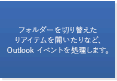
-->

### Outlook 2007 以降のオブジェクト モデルまたは PIA でサポートされているシナリオ

ベースライン シナリオに加えて、Outlook ソリューションが次のリストにあるシナリオのいずれかをサポートしている場合、使用しているソリューションが Outlook 2007 以降のバージョンでのみ実行されるものであれば、オブジェクトモデルや PIA も使用できます。 このセクションでは、Outlook オブジェクトモデルで各シナリオを拡張するために使用することができる主なオブジェクトまたはメンバーを指定します（Visual Studio オートメーションオブジェクトモデルの[IDTExtensibility2](https://docs.microsoft.com/dotnet/api/extensibility.idtextensibility2?view=visualstudiosdk-2017) インターフェイスと、Outlook オブジェクトモデルに統合できる Office オブジェクトモデルでの[IRibbonExtensibility](https://docs.microsoft.com/office/vba/api/Office.IRibbonExtensibility)インターフェイスを除く）。 

- [Outlook UI をカスタマイズする: Office Fluent リボン、ナビゲーションウィンドウ、作業ウィンドウ](#OLSelectAPI_CustomizeTheOutlookInterface)
- [フォームをフォーム領域としてカスタマイズして、アドイン別に展開する](#OLSelectAPI_CustomFormRegions)
- [オブジェクト モデルでは公開されていないアイテム レベルの組み込みプロパティの設定および取得](#OLSelectAPI_CustomizingProperties)
- [フォルダー内の多数のアイテムの列挙と表示](#OLSelectAPI_Enumerating)
- [アイテムにタスクのフラグを付ける](#OLSelectAPI_ItemsFlag)
- [カレンダー、RSS フィード、およびフォルダーの共有](#OLSelectAPI_Sharing)
- [添付ファイルの追加、削除、保存、およびブロックレベル、パス、サイズ、種類の取得](#OLSelectAPI_Attachments)
- [ルール、タイム ゾーン、ビューの管理](#OLSelectAPI_Misc)
- [現在のプロファイルのマスターカテゴリリストでの分類項目の追加または削除](#OLSelectAPI_Categories)
- [現在のプロファイルでアカウントの詳細情報を取得する](#OLSelectAPI_PrimaryAccount)
- [Exchange の配布リストまたはアドレスエントリとしてのユーザーの詳細情報を取得する](#OLSelectAPI_AddressBook)
- [ソリューション用のプライベート データの保管](#OLSelectAPI_StoringData)

<!--More removed images
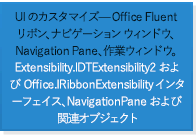
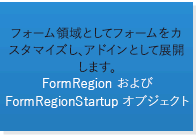
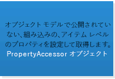

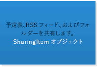

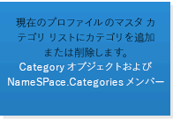

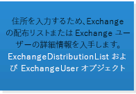

-->

### Outlook 2010 以降のオブジェクト モデルまたは PIA でサポートされているシナリオ

Outlook ソリューションを Outlook 2010 以降のバージョンでのみ実行する場合には、次のセクションで示されるシナリオをサポートするオブジェクト モデルまたは PIA を選択して使用できます。 このセクションでは、Outlook オブジェクトモデルで各シナリオを拡張するために使用できる主なオブジェクトまたはメンバーを指定します（Outlook オブジェクトモデルと統合できる Office オブジェクトモデル内の[IRibbonControl](https://docs.microsoft.com/office/vba/api/Office.IRibbonControl)、[IRibbonExtensibility](https://docs.microsoft.com/office/vba/api/Office.IRibbonExtensibility)、[IRibbonUI](https://docs.microsoft.com/office/vba/api/Office.IRibbonUI)インターフェースを除く）。 
   
- [Office Backstage ビューやコンテキストメニューなどの Outlook 2010 UI をカスタマイズする](#OLSelectAPI_CustomizingUIOutlook2010)
- [スレッドの異種アイテムを管理し、アクセスする](#OLSelectAPI_Conversations)
- [エクスプローラー内でのアイテムの選択の管理、または選択したアイテムの特定](#OLSelectAPI_ItemSelection)
- [インスペクター内での添付ファイルの選択の管理](#OLSelectAPI_AttachmentSelection)
- [1 つのプロファイルでの複数の Exchange アカウントのサポート](#OLSelectAPI_MultipleAccounts)
- [住所を入力する連絡先カードの作成](https://docs.microsoft.com/office/vba/api/Outlook.NameSpace.CreateContactCard)
- [ソリューション モジュールでソリューション固有のフォルダーを整理する](#OLSelectAPI_Folders)

<!--more removed images:

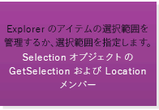

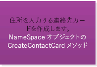
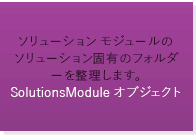
-->

### Outlook 2013 以降のオブジェクト モデルまたは PIA でサポートされているシナリオ

Outlook ソリューションを Outlook 2013 以降のバージョンでのみ実行する場合には、次のリソースで示されるシナリオをサポートするオブジェクト モデルまたは PIA を使用できます。

- [現在のフォルダー内のすべての連絡先のビューを表示](https://docs.microsoft.com/office/vba/api/Outlook.peopleview)
- [閲覧ウィンドウのインライン応答を選択](#OLSelectAPI_InlineResponse)
- [連絡先の住所またはフルネームをチェックするダイアログを表示](#OLSelectAPI_ContactCheckDialogs)
- [アイテムのプロパティの読み取り完了を検知](https://docs.microsoft.com/office/vba/outlook/How-to/Items-Folders-and-Stores/outlook-item-objects)

<!--more removed images:
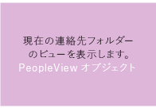
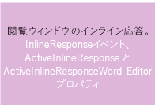
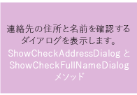

-->

## MAPI の決定要因

一般に、Microsoft Exchange サーバーなどの MAPI ベースのサーバーにあるデータにアクセスしたり、次のような作業を行ったりするには、MAPI を使用します。
  
- アドレス帳プロバイダー、転送プロバイダー、ストア プロバイダーなどのカスタム サービス プロバイダーの作成。
    
- シンク プロセスの作成。
    
- プロファイルの作成または操作。
    
- アプリケーションの Windows NT サービスとしての実行。
    
- バック グラウンド スレッドでのタスクの実行。たとえば、フォルダー内の多数のアイテムを列挙したり、バックグラウンド スレッドのアイテムのプロパティを変更したりすることでパフォーマンスを最適化できます。
    
詳細およびコード サンプルについては、「[Outlook MAPI リファレンス](https://msdn.microsoft.com/library/3d980b86-7001-4869-9780-121c6bfc7275%28Office.15%29.aspx)」および「[MFCMAPI](https://mfcmapi.codeplex.com/)」を参照してください。
  
また、ソリューションを Outlook 2007 より前のバージョンの Outlook で実行し、次のようなシナリオがソリューションに適用される場合は、MAPI を使用してそのシナリオを拡張してください。
  
- オブジェクト モデルでは公開されていないアイテム レベルの組み込みプロパティの設定および取得。
    
- アカウント、添付ファイル、Exchange 配布リスト、Exchange ユーザー、ストアの管理。
    
- ソリューション用のプライベート データの保管。
    
- アカウントのメッセージ ストアの管理。
    
Outlook 2007 より前であれば開発者が MAPI または Microsoft Collaboration Data Objects (CDO) 1.2.1 や Microsoft Exchange Client Extensions といった他の API の力を借りて実現していた広範囲の機能を、Outlook 2007 以降はオブジェクト モデルがサポートしています。したがって、前述のリストのいずれかのシナリオが自分のソリューションに当てはまるものの、ソリューションを Outlook 2007 または Outlook 2010 上で実行する場合は、Outlook オブジェクト モデルまたは PIA を使用してこれらのシナリオをサポートすることができますし、そのようにすることをお薦めします。Outlook 開発テクノロジを統合する Outlook 2007 拡張機能に関する詳細については、「[What's New for Developers in Outlook 2007 (Part 1 of 2)](https://msdn.microsoft.com/library/76e3f0b7-ef2b-4e9f-8515-3002d75d7721%28Office.15%29.aspx)」を参照してください。

## 補助 API の決定要因

Outlook 補助 API は、オブジェクト モデルや MAPI ではソリューションが提供されない一部のシナリオの Outlook ビジネス ロジックや MAPI と統合できます。次のシナリオでは Outlook 補助 API を使用します。
  
- アカウント管理: アカウント情報の管理、アカウントの操作、アカウント変更に関する通知の提供、スパムからのアカウントの保護を行います。 
    
- データ劣化: オブジェクトをネイティブ形式で公開するのではなく、推奨される文字形式でオブジェクトをラップします。
    
- カレンダーとタイム ゾーンのサポートの再編成: 夏時間をサポートするように Outlook 予定表を再編成します。
    
- 空き時間情報: 予定表の空き時間情報を提供します。
    
- 連絡先の写真: Outlook に連絡先の画像を表示するか決定します。
    
- アイテムの現在状態: Outlook アイテムの変更がまだ保存されていないか確認します。
    
- アイテムの分類: Outlook アイテムを送信後に、そのアイテムを分類します。
    
補助 API の詳細については、「[その他の技術資料補助 API](#OLSelectAPI_AdditionalResourcesAuxAPIs)」セクションをご覧ください。 

## インプロセス ソリューションとプロセス外ソリューションによる Outlook 自動化の違い

> [!NOTE]
> このセクションと次のセクションの Outlook 自動化に関する論考は、Office アドイン の対象ではありません。Office アドイン は、Office クライアントや Web アプリケーションの機能性を拡張することを目的としており、自動化することを目的とはしていません。 
  
Outlook は、Outlook プロセスと同じフォアグラウンド プロセスで実行するアドインを使用することや、Outlook プロセス外部の別個の独自プロセスで実行するスタンドアロン ソリューションによって、自動化をサポートします。一般に、Outlook を自動化するには、アドインを使用してオブジェクト モデル、PIA、MAPI 経由で、あるいはまれに補助 API ([HrProcessConvActionForSentItem](auxiliary/hrprocessconvactionforsentitem.md) など) 経由で Outlook と対話します。プロセス外ソリューションは、それが必要な場合にのみ使用します (たとえば、Tzmovelib.dll ファイルを使って顧客の Outlook 予定表を再編成する MAPI クライアント アプリケーションを作成している場合や、フォルダー内の多数のアイテムを列挙し、パフォーマンスを最適化するためにそのアイテムのプロパティをバックグラウンド スレッドで変更する場合など)。 
  
アドインは Outlook 自動化の推奨ソリューションです。それは、Outlook がアドインの [OnConnection(Object, ext_ConnectMode, Object, Array)](https://msdn.microsoft.com/library/797003e7-ecd1-eccb-eaaf-32d6ddde8348%28Office.15%29.aspx) イベント中、アドインに渡される [Application](https://msdn.microsoft.com/library/Extensibility.IDTExtensibility2.OnConnection.aspx) オブジェクトのみを信頼するからです。この **Application** オブジェクトからすべてのオブジェクト、プロパティ、メソッドを派生させることにより、オブジェクト モデル ガードのセキュリティ警告が表示されないようにすることができます。アドインが **Application** オブジェクトの新規インスタンスを作成する場合は、そのアドインが信頼されたアドインのリストに含まれているとしても、Outlook はそのオブジェクトを信頼しません。そのような **Application** オブジェクトから派生したオブジェクト、プロパティ、メソッドはいずれも信頼されず、ブロックされたプロパティやメソッドによってセキュリティ警告が呼び出されます。Outlook オブジェクト モデル ガードの詳細については、「 [Outlook オブジェクト モデルのセキュリティ動作](https://msdn.microsoft.com/library/4aa3b7c7-5f3f-41ce-bbf3-75d8ecbd6d4f%28Office.15%29.aspx)」を参照してください。

## マネージ ソリューションとアンマネージ ソリューションによる Outlook 自動化の違い

Outlook は、マネージ言語またはアンマネージ言語で作成されたアドインとスタンドアロン アプリケーションによる自動化をサポートします。よく使用されるマネージ言語は C# と Visual Basic です。C++ と Delphi のツールはよくアンマネージ環境で使用されます。マネージ開発とアンマネージ開発のどちらを選択するかは、熟練したプログラマを調達できるかどうかを考慮して決定することになります。 
  
使用するソリューションがオブジェクト モデルのみを使用する場合は、PIA または Visual Studio の Office 開発ツールを使用したマネージ ソリューションの開発を検討できます。Visual Studio の Office 開発ツールにはプロジェクト テンプレートとビジュアル デザイナーが用意されていて、カスタム ユーザー インターフェイスの作成と Office ソリューションの開発を容易に行えます。
  
他方、MAPI は .NET Framework より何年も前に開発されており、Microsoft は MAPI 用のマネージ ラッパーを提供していないため、Microsoft ではマネージ コード内での MAPI の使用をサポートしていません。MAPI を使用している場合は、アンマネージ ソリューションを開発する必要があります。詳細については、「[クライアント側メッセージング開発のサポート ガイドライン](https://support.microsoft.com/kb/266353/en-us)」を参照してください。

## 最適な API とテクノロジ

Outlook Social Connector (OSC) と天気予報バーは、Outlook の非常に特殊なシナリオの拡張をサポートします。 
  
### Outlook Social Connector (OSC) プロバイダー拡張機能

Outlook Social Connector (OSC) プロバイダー拡張機能は、ソーシャル ネットワークでの友人やアクティビティの更新を Outlook や他の Office クライアント アプリケーション上に表示できるようにするソーシャル ネットワーク用のプロバイダーの開発をサポートします。図 6 は、人物情報ウィンドウにソーシャル ネットワーク サイトの人物のアクティビティを表示する OSC を示しています。
  
**図 6. 人物情報ウィンドウにソーシャル ネットワーク データを表示する OSC**

![[Outlook Social Connector] ウィンドウ](media/2d6b867f-73d8-4a3b-b8bd-3844bc34bf4e.jpg)
  
Outlook の OSC は、ユーザーが Outlook の人物からの電子メール、添付ファイル、会議出席依頼の情報を人物情報ウィンドウに表示できます。組織の環境では、SharePoint サイト上で共同作業するユーザーは、その人物の SharePoint サイトでのドキュメント更新と他のサイトアクティビティを確認できます。Outlook Social Connector プロバイダー拡張機能は、ソーシャル ネットワークの更新を Outlook で同期化および表示するための OSC 用のプロバイダーの開発をサポートします。一般的な OSC プロバイダー (Facebook や LinkedIn など) はデフォルトで Outlook にインストールされています。Outlook ユーザーがサインインするソーシャル ネットワーク サイトによっては、ユーザーは接続するソーシャル ネットワークの写真、ステータス、アクティビティの更新などを人物情報ウィンドウに表示できます。 
  
### 天気予報バー拡張機能

Outlook 2013 以降、天気予報バー用のサード パーティの天気 Web サービスをプラグインして、ユーザーが選択した場所の天気条件データを提供することができます。Outlook の天気バーには、ある地点の天気状況と天気予報が表示されます。ユーザーは 1 つ以上の地点を選択して、予定表モジュールの天気バーという便利な場所に天気データを表示できます。図 7 は、ニューヨーク州ニューヨークの 3 日間の天気予報が表示された天気バーを示しています。 
  
**図 7. Outlook の天気バー**

  
既定では、Outlook は MSN 天気が提供する天気データを使用します。天気バーは、Outlook との通信用に定義されたプロトコルに準拠するサード パーティの天気データ Web サービスをサポートします。サード パーティの天気データ サービスがこのプロトコルをサポートする限り、ユーザーはその天気データ サービスを選択して天気バーに天気データを提供できます。
  
OSC プロバイダー拡張機能と天気バー拡張機能の使用の詳細については、「[その他の技術資料主な参照資料、リソース、コード サンプル](#OLSelectAPI_AdditionalResourcesRefCode)」セクションをご覧ください。 

## まとめ

ソリューションに最適な API またはテクノロジを判断するには、まずソリューションの目標を明確にする必要があります。 
  
- ソリューションでサポートすることにしている Outlook のバージョン。
    
- ソリューションで優先度の高いシナリオ。ソリューションでは、主にメッセージや予定の内容とプロパティを処理しますか? それともソリューションではアプリケーション レベルで Outlook を自動化しますか? いずれかに該当する場合、そのシナリオには多数の Outlook アイテムを含むフォルダーの列挙、フィルター処理、変更が関係しますか?
    
まず、Office アドイン プラットフォームのメール アプリ サポートがニーズを満たしているかどうかを確認します。「[Office プラットフォーム用アプリの客観的な評価基準](#OLSelectAPI_ObjectiveEvalCritApps)」の「機能上の基準」セクションを参照して、主なオブジェクトや機能がシナリオをサポートするかどうかを判断します。セクション「[Office プラットフォーム用アプリの決定要因](#OLSelectAPI_FactorsApps)」を参照して、シナリオにとってアドインよりもメール アプリがよりよい選択であるかどうかを判断します。通常は、可能であれば、各種フォーム ファクター用の Outlook クライアントでプラットフォームのサポートを活用できるように、ソリューションをアプリとして開発します。 
  
シナリオによる拡張がメッセージと予定以外も含む場合、またはOutlook をアプリケーション レベルで自動化する必要がある場合は、「[オブジェクト モデルまたは PIA の決定要因](#OLSelectAPI_FactorsOM)」のセクションで略述されているシナリオと照らし合わせてみてください。対象となるバージョンの Outlook のオブジェクト モデル (または PIA) がシナリオをサポートするものの、ソリューションが多数のアイテムを含むフォルダーを処理できない場合は、そのソリューションをマネージ言語またはアンマネージ言語のアドインとして実装することをお薦めします。 
  
対象となるバージョンの Outlook のオブジェクト モデル (または PIA) が一部のシナリオをサポートしていない場合は、「[MAPI の決定要因](#OLSelectAPI_FactorsMAPI)」または「[補助 API の決定要因](#OLSelectAPI_FactorsAux)」セクションのシナリオで要件が満たされるかどうか確認してください。MAPI で要件が満たされる場合はアンマネージ コードでソリューションを実装します。補助 API でシナリオの 1 つが解決される場合はマネージ コードまたはアンマネージ コードを使用できます。 
  
ソリューションが MAPI を使用する場合は、ソリューションを C++ などのアンマネージ コードで実装する必要があります。それ以外の場合、ソリューションの作成にマネージ コードとアンマネージ コードのどちらを使用するかは、一般的に言って利用可能な人材とその熟練度によって決まります。ソリューションをアドインとスタンドアロン アプリケーションのどちらとして実装するかを決定するときは、多数のアイテムを含むフォルダーの操作が必要となるシナリオでなければ、ユーザーが何度も Outlook Object Model Guard を呼び出さなくてもよいように、アドインを選択してください。操作が必要なシナリオの場合は、ソリューションをバックグラウンド スレッドで実行するように実装すると、Outlook パフォーマンスを最適化できます。
  
シナリオにソーシャル ネットワークの情報や更新を Outlook に表示する処理が含まれる場合は、OSC プロバイダー拡張機能を使用して COM 可視 DLL を作成してください。この作業はマネージ言語とアンマネージ言語のどちらでも行えます。
  
サード パーティの天気データ サービスを天気バーにプラグインすることを検討している場合は、天気バー拡張機能で定義されているプロトコルに準拠すれば、目的にかなった Web サービスを提供することができます。そのような Web サービスはマネージ言語で作成できます。
  
ソリューションで使用する API またはテクノロジが決まったなら、詳細について「[その他の技術資料主な参照資料、リソース、コード サンプル](#OLSelectAPI_AdditionalResourcesRefCode)」セクションのその他の資料やコード サンプルを参照できます。 

## 関連項目: Office アドイン

[Office 用アプリの構築を開始する](https://msdn.microsoft.com/library/e64de870-ce22-4331-92e7-76d35279bf91%28Office.15%29.aspx) には、アーキテクチャや開発ライフ サイクルを含む Office アドイン の概要がわかりやすく提供されています。 
  
メール アプリの開発に関するリソースの詳細なロードマップについては、「[Outlook アドイン](https://msdn.microsoft.com/library/71e64bc9-e347-4f5d-8948-0a47b5dd93e6%28Office.15%29.aspx)」を参照してください。 

## 関連項目: オブジェクト モデルと PIA

オブジェクトモデルと PIA の使用方法の詳細については、次のリソースを参照してください。

### アカウントプロファイルのプライマリ Exchange アカウント

- [Account](https://msdn.microsoft.com/library/f624438c-4e45-2822-18b6-bfe8074a33c0%28Office.15%29.aspx) オブジェクト 
    
- [NameSpace.Accounts](https://msdn.microsoft.com/library/80e969ea-d2cc-966d-5fe4-68d59951b5c9%28Office.15%29.aspx) プロパティ 

### アカウントプロファイルの複数アカウント

- [Account](https://msdn.microsoft.com/library/f624438c-4e45-2822-18b6-bfe8074a33c0%28Office.15%29.aspx) オブジェクト 
    
- [Outlook の同一プロファイルに複数のアカウントを使用する](https://msdn.microsoft.com/library/9e06e076-d62a-37c8-4502-709da5a0b104%28Office.15%29.aspx)
    
- [複数のアカウントの情報を取得する](https://msdn.microsoft.com/library/af587ee2-429a-252f-ecb6-2f058b9a37a8%28Office.15%29.aspx)
    
- [Outlook 2010 で複数の Exchange アカウントを操作する](https://msdn.microsoft.com/library/b5a80da9-102d-4617-8a06-49ded01a237a%28Office.15%29.aspx)

### アドレス帳と Exchange ユーザー

- [アドレス帳から名前を表示する](https://msdn.microsoft.com/library/32e7179c-8133-ee20-ecf6-52c9275f205f%28Office.15%29.aspx)
    
- [アドレス帳から Exchange ユーザーまたは配布リストの情報にアクセスする](https://msdn.microsoft.com/library/077a8666-09c5-e641-0b9b-7d83133d931f%28Office.15%29.aspx)
    
- [自分の管理者が属するグループを一覧表示する](https://msdn.microsoft.com/library/2f0ff92c-e026-4f62-c039-fbda9aaf1546%28Office.15%29.aspx)
    
- [Exchange 配布リストに属する各管理者の名前と勤務先を一覧表示する](https://msdn.microsoft.com/library/abc26854-62db-be7f-4025-46acbcb42541%28Office.15%29.aspx)
    
- [AddressEntries](https://msdn.microsoft.com/library/db91b717-07c6-d1f2-c545-b766ee1f0c6b%28Office.15%29.aspx) オブジェクト 
    
- [AddressLists](https://msdn.microsoft.com/library/b8c5ce75-3030-0179-45bb-f44fe6628074%28Office.15%29.aspx) オブジェクト 
    
- [ExchangeDistributionList](https://msdn.microsoft.com/library/2830dfba-6c0a-a81f-6b98-92ac2aafb59d%28Office.15%29.aspx) オブジェクト 
    
- [ExchangeUser](https://msdn.microsoft.com/library/6ec117d1-7fdb-aa36-b567-1242f8238df0%28Office.15%29.aspx) オブジェクト 
    
- [SelectNamesDialog](https://msdn.microsoft.com/library/1522736a-3cad-9f1c-4da9-b52a3a01731c%28Office.15%29.aspx) オブジェクト 

### 添付ファイル

- [メール アイテムにファイルを添付する](https://msdn.microsoft.com/library/1d94629b-e713-92cb-32de-c8910612e861%28Office.15%29.aspx)
    
- [Outlook 2010 で制限される添付ファイルの種類](https://technet.microsoft.com/ja-JP/library/cc179163.aspx)
    
- [Attachment](https://msdn.microsoft.com/library/3e11582b-ac90-0948-bc37-506570bb287b%28Office.15%29.aspx) オブジェクト 
    
- [AttachmentSelection](https://msdn.microsoft.com/library/398cf106-a904-9048-e627-e47aaadf1105%28Office.15%29.aspx) オブジェクト 
    
- アイテム オブジェクトごとの **AttachmentAdd** イベント 
    
- アイテム オブジェクトごとの **AttachmentRead** イベント 
    
- アイテム オブジェクトごとの **AttachmentRemove** イベント 
    
- アイテム オブジェクトごとの **BeforeAttachmentAdd** イベント 
    
- アイテム オブジェクトごとの **BeforeAttachmentPreview** イベント 
    
- アイテム オブジェクトごとの **BeforeAttachmentRead** イベント 
    
- アイテム オブジェクトごとの **BeforeAttachmentSave** イベント 
    
- アイテム オブジェクトごとの **BeforeAttachmentWrite** イベント 

### 添付ファイル: 検査での選択

- [Inspector.AttachmentSelection](https://msdn.microsoft.com/library/19466ce7-def8-4cce-1776-dcea1df9f15d%28Office.15%29.aspx) プロパティ 
    
- [Inspector.AttachmentSelectionChange](https://msdn.microsoft.com/library/1250045d-bcb3-b823-31d5-ec31c64ad59e%28Office.15%29.aspx) イベント 

### Outlook の自動化

- [COM アドインを使用した Outlook のカスタマイズ](https://msdn.microsoft.com/library/84a4f616-3ace-0139-57d5-f0c070064ab2%28Office.15%29.aspx)
    
- [Outlook 2010 の C++ アドインをビルドする](https://msdn.microsoft.com/library/70b308e7-d713-4a26-9892-5021f7320674%28Office.15%29.aspx)
    
- [COM と .NET の相互運用性の概要](https://msdn.microsoft.com/library/6b2d099a-ec6f-4099-aaf6-e61003fe5a32%28Office.15%29.aspx)
    
- [Outlook PIA を使用する理由](https://msdn.microsoft.com/library/5cc9085e-7c97-4698-8cb9-e33e427c02e7%28Office.15%29.aspx)
    
- [マネージ Outlook アドインの開発でのベスト プラクティス](https://msdn.microsoft.com/library/a03246f6-2ca5-4fcb-8e63-a11cfbc8d9a0%28Office.15%29.aspx)
    
- [Outlook のインスタンスを取得してログインする](https://msdn.microsoft.com/library/ef369364-6500-2759-3ef4-ed4411112e96%28Office.15%29.aspx)
    
- [Visual Basic Application から Outlook を自動化する](https://msdn.microsoft.com/library/623f91af-cd50-1ff0-9519-5a39cbcf5d18%28Office.15%29.aspx)
    
- [他の Office アプリケーションを使用した Outlook の自動化](https://msdn.microsoft.com/library/d3e44f80-df67-2d28-94dc-14d7a8c8c26c%28Office.15%29.aspx)

### カテゴリ

- [Outlook アイテムを分類する](https://msdn.microsoft.com/library/e8cfb450-b8b0-bee6-fdf0-d0a92bf9af56%28Office.15%29.aspx)
    
- [Category](https://msdn.microsoft.com/library/143ef095-54b0-cbe2-e356-632029061ac2%28Office.15%29.aspx) オブジェクト 
    
- [NameSpace.Categories](https://msdn.microsoft.com/library/3963afca-3a7e-38d7-1347-7e1467be3a10%28Office.15%29.aspx) プロパティ 

### 連絡先: 住所とフル ネームの確認

- [ContactItem.ShowCheckAddressDialog](https://msdn.microsoft.com/library/773a1a3c-1247-fd48-399a-728766e56570%28Office.15%29.aspx) メソッド 
    
- [ContactItem.ShowCheckFullNameDialog](https://msdn.microsoft.com/library/d42632e3-6f50-cce7-80c6-cf846be1f925%28Office.15%29.aspx) メソッド 

### 会話

- [Outlook アイテムをスレッドとして管理する](https://msdn.microsoft.com/library/d91959d7-07b2-7952-8e6d-a39422d355e0%28Office.15%29.aspx)
    
- [選択されたスレッドを取得して列挙する](https://msdn.microsoft.com/library/3bba1e98-b2eb-c53d-354a-bdd899b65a59%28Office.15%29.aspx)
    
- [Conversation](https://msdn.microsoft.com/library/2705d38a-ebc0-e5a7-208b-ffe1f5446b1b%28Office.15%29.aspx) オブジェクト 
    
- [ConversationHeader](https://msdn.microsoft.com/library/5142d5f7-55c1-4d9d-3a11-d25c8763fcb7%28Office.15%29.aspx) オブジェクト 
    
- [SimpleItems](https://msdn.microsoft.com/library/b929ae28-fe5f-607e-37b5-ed6a304d4896%28Office.15%29.aspx) オブジェクト 
    
- アイテム オブジェクトごとの **ConversationID** プロパティ 

### イベント

- [Outlook イベントを使用する](https://msdn.microsoft.com/library/514f8f31-8047-2a9f-cbac-d0a23218f49c%28Office.15%29.aspx)
    
- [インスペクターのラッパーを実装し、インスペクターごとにアイテム レベルのイベントを追跡する](https://msdn.microsoft.com/library/8021dd2b-c36c-492b-b281-783e85140ad8%28Office.15%29.aspx)

### エクスプローラー: インライン応答

- [Explorer.ActiveInlineResponse](https://msdn.microsoft.com/library/fc38314d-7cff-44f4-9151-6129f918a721%28Office.15%29.aspx) プロパティ 
    
- [Explorer.ActiveInlineResponseWordEditor](https://msdn.microsoft.com/library/b9058694-ab8f-4962-ab7d-afac1704dd29%28Office.15%29.aspx) プロパティ 
    
- [Explorer.InlineResponse](https://msdn.microsoft.com/library/5dbaddbd-e6cd-4776-b417-c67f51b12812%28Office.15%29.aspx) イベント 

### アイテム: 基本のプロパティ、フィールド、フォーム

- [Outlook アイテム オブジェクト](https://msdn.microsoft.com/library/6ea4babf-facf-4018-ef5a-4a484e55153a%28Office.15%29.aspx)
    
- [ItemProperties](https://msdn.microsoft.com/library/34a110ed-6617-72da-1e98-a9773c705b40%28Office.15%29.aspx) オブジェクト 
    
- [UserProperties](https://msdn.microsoft.com/library/20b49c86-d74f-9bda-382c-559af278c148%28Office.15%29.aspx) オブジェクト 
    
- [標準フィールドの概要](https://msdn.microsoft.com/library/f0d903a3-f404-8511-af3d-d4f3e30f0779%28Office.15%29.aspx)
    
- [Outlook のフィールドに対応するプロパティ](https://msdn.microsoft.com/library/acc5d2c5-f579-0a60-5676-3faa63f26c0e%28Office.15%29.aspx)
    
- [カスタム フィールドとデータ型の概要](https://msdn.microsoft.com/library/a85a7bc2-2b85-1782-04a3-0104e0df32aa%28Office.15%29.aspx)
    
- [フォーム ページとフォーム領域をカスタマイズする](https://msdn.microsoft.com/library/c8c2d080-66a8-b761-bdc0-527b209e0bd1%28Office.15%29.aspx)

### アイテム: プロパティのカスタマイズ

- [プロパティの概要](https://msdn.microsoft.com/library/242c9e89-a0c5-ff89-0d2a-410bd42a3461%28Office.15%29.aspx)
    
- [Efficiently Getting and Setting Custom Properties in a Contact Folder in Outlook 2010](https://msdn.microsoft.com/library/bb49f7a6-ec0a-483a-a27e-e843c6af781b%28Office.15%29.aspx)
    
- [PropertyAccessor](https://msdn.microsoft.com/library/2fc91e13-703c-3ec9-9066-ffee7144306c%28Office.15%29.aspx) オブジェクト 

### アイテム: 列挙、フィルター処理、並べ替え

- [Outlook のアイテムを保存する](https://msdn.microsoft.com/library/e4a639a4-10b2-7665-9261-19d6e7707e48%28Office.15%29.aspx)
    
- [Table オブジェクトに表示される既定のプロパティ](https://msdn.microsoft.com/library/649c64f3-2d1e-23f1-bf13-3368da79e62b%28Office.15%29.aspx)
    
- [Efficiently Filtering Contact Items in a Contact Folder in Outlook 2010](https://msdn.microsoft.com/library/b8dd39e7-d716-4acd-873b-d2b0faaff30d%28Office.15%29.aspx)
    
- [フォルダー内のアイテムの列挙、検索、フィルター](https://msdn.microsoft.com/library/d786d292-7a0e-0e1a-e132-affbfde37744%28Office.15%29.aspx)
    
- [フォルダー内のアイテムを並べ替える](https://msdn.microsoft.com/library/bc3651da-cfdb-4301-4034-bb848f371e55%28Office.15%29.aspx)
    
- [Table](https://msdn.microsoft.com/library/0affaafd-93fe-227a-acee-e09a86cadc20%28Office.15%29.aspx) オブジェクト 

### アイテム: タスクとしてのフラグ

[MailItem](https://msdn.microsoft.com/library/14197346-05d2-0250-fa4c-4a6b07daf25f%28Office.15%29.aspx) オブジェクトなどの一部のアイテム オブジェクトで次のタスク関連のプロパティを参照してください。 
  
- [TaskCompleteDate](https://msdn.microsoft.com/library/4bee35d4-1f1e-0b77-2021-84d4916bef8e%28Office.15%29.aspx) プロパティ 
    
- [TaskDueDate](https://msdn.microsoft.com/library/161ed0ed-0e3f-2e4c-7e63-daad4e918dd6%28Office.15%29.aspx) プロパティ 
    
- [TaskStartDate](https://msdn.microsoft.com/library/76b7109f-55fc-b7e2-63dc-bf7804a709f5%28Office.15%29.aspx) プロパティ 
    
- [TaskSubject](https://msdn.microsoft.com/library/f7e4629f-ad47-b455-9fee-b5e537602a34%28Office.15%29.aspx) プロパティ 
    
- [ToDoTaskOrdinal](https://msdn.microsoft.com/library/d1ccb01a-0792-3779-3f94-eb5195a39bb0%28Office.15%29.aspx) プロパティ 

### アイテム: Explorer での選択

- [Selection.GetSelection](https://msdn.microsoft.com/library/c6af6665-d97d-3833-1014-5b43282bafc2%28Office.15%29.aspx) メソッド 
    
- [Selection.Location](https://msdn.microsoft.com/library/8a2db72a-8db0-840e-349e-5d9d22f3affb%28Office.15%29.aspx) プロパティ 

### その他: ビジネス カード、ルール、ビュー

- [名刺をカスタマイズおよび共有する](https://msdn.microsoft.com/library/d29fd962-ea5f-040d-e9af-e8ab70595832%28Office.15%29.aspx)
    
- [Outlook オブジェクト モデルのルールを管理する](https://msdn.microsoft.com/library/05ddd643-e9bd-a37d-b680-b8519960a5f6%28Office.15%29.aspx)
    
- [特定の電子メールをフォルダーに移動するルールを作成する](https://msdn.microsoft.com/library/e72fa307-8224-c2d2-1318-a18cd8e9f22f%28Office.15%29.aspx)
    
- [Rules](https://msdn.microsoft.com/library/dd41b4de-bf5f-5532-46c9-394a5d078bec%28Office.15%29.aspx) オブジェクト 
    
- [RuleActions](https://msdn.microsoft.com/library/82ba76cd-86a4-3372-cb51-2df1d58c8b71%28Office.15%29.aspx) オブジェクト 
    
- [RuleConditions](https://msdn.microsoft.com/library/b2af6ebf-f9f8-8106-20a3-1725c3b78174%28Office.15%29.aspx) オブジェクト 
    
- [TimeZones](https://msdn.microsoft.com/library/c68f8589-44e9-3c12-45c1-96943fa9bcb7%28Office.15%29.aspx) オブジェクト 
    
- [Outlook のビュー](https://msdn.microsoft.com/library/cbaa3192-6c27-26c0-ebd6-f6489c2e812e%28Office.15%29.aspx)
    
- [Views](https://msdn.microsoft.com/library/5dd7edc2-12a2-f4c2-d158-8053d80e8dc9%28Office.15%29.aspx) オブジェクト 

### セキュリティ

- [Outlook オブジェクト モデルのセキュリティ動作](https://msdn.microsoft.com/library/4aa3b7c7-5f3f-41ce-bbf3-75d8ecbd6d4f%28Office.15%29.aspx)
    
- [Outlook 2010 でのシャットダウンの変更](https://msdn.microsoft.com/library/1b154d46-8d13-4c65-91e3-180b22603d03%28Office.15%29.aspx)
    
- [Outlook 2010 で制限される添付ファイルの種類](https://technet.microsoft.com/ja-JP/library/cc179163.aspx)
    
- [アプリケーションの終了に関する Outlook 2007 SP2 での変更点](https://msdn.microsoft.com/library/795a8237-7804-4da4-9d04-2bb663d300d9%28Office.15%29.aspx)
    
- [Code Security Changes in Outlook 2007](https://msdn.microsoft.com/library/26a9fd8f-6277-48ac-a92f-3ff46e1d883a%28Office.15%29.aspx)

### 共有

- [予定表を共有する](https://msdn.microsoft.com/library/03e0b693-5446-ca62-f868-69a583087966%28Office.15%29.aspx)
    
- [オンライン予定表、RSS フィード、Microsoft SharePoint Foundation フォルダー、Exchange フォルダーを共有する](https://msdn.microsoft.com/library/e579e026-bd10-37bb-eb3e-5c9f042fa0fa%28Office.15%29.aspx)
    
- [SharingItem](https://msdn.microsoft.com/library/63dd3451-44f3-7cc4-c6e2-7dad5835a7d2%28Office.15%29.aspx) オブジェクト 

### ソリューション: ソリューション固有のフォルダー

- [Outlook 2010 ソリューション モジュールのプログラミング](https://msdn.microsoft.com/library/5989a3da-2f2a-4abd-87b0-cc0e1560dd59%28Office.15%29.aspx)
    
- [SolutionsModule](https://msdn.microsoft.com/library/4597765e-a95d-bf07-2ac4-103218ebc696%28Office.15%29.aspx) オブジェクト 

### ソリューション: データの保管

- [ソリューションのデータを保存する](https://msdn.microsoft.com/library/58e69983-5718-4dde-64fc-858abd80c9e5%28Office.15%29.aspx)
    
- [StorageItem](https://msdn.microsoft.com/library/41776bc3-b838-2755-fd6b-3b5012fb9ae5%28Office.15%29.aspx) オブジェクト 

### ユーザー インターフェイス: フォーム領域のカスタマイズ

- [フォーム ページとフォーム領域をカスタマイズする](https://msdn.microsoft.com/library/c8c2d080-66a8-b761-bdc0-527b209e0bd1%28Office.15%29.aspx)
    
- [フォーム領域](https://msdn.microsoft.com/library/66e80f83-60db-e3b1-47e9-097f855f6512%28Office.15%29.aspx)
    
- [フォーム領域を作成する](https://msdn.microsoft.com/library/695b95a5-c795-cb4a-8d35-ba12b0007b1f%28Office.15%29.aspx)
    
- [チュートリアル: フォーム上の既存のページにフォーム領域を追加する](https://msdn.microsoft.com/library/3c988dac-f171-966d-cf9a-17139353d604%28Office.15%29.aspx)
    
- [Building an Outlook 2007 Form Region with a Managed Add-In](https://msdn.microsoft.com/library/cc8503c2-9e17-4718-a757-9f0b7d42f0ee%28Office.15%29.aspx)
    
- [Implementing a Form Region to Display Email Headers in Outlook 2010](https://msdn.microsoft.com/library/243a4e64-d4ea-4cfc-871e-af19d622fb1b%28Office.15%29.aspx)
    
- [FormRegion](https://msdn.microsoft.com/library/3a0b83eb-4076-9cb3-86a9-68f9e44df89f%28Office.15%29.aspx) オブジェクト 
    
- [FormRegionStartup](https://msdn.microsoft.com/library/948ea6b7-2962-57e7-618d-fa0977b65651%28Office.15%29.aspx) オブジェクト 

### ユーザー インターフェイス: Outlook 2007 以降のカスタマイズ

- [リボンのユーザー設定の概要](https://msdn.microsoft.com/library/ee49751d-9eae-357c-5fa9-0b2dd4ff0890%28Office.15%29.aspx)
    
- [Customizing the Ribbon in Outlook 2007](https://msdn.microsoft.com/library/946e97ea-f556-4e84-8fac-01cd9214e170%28Office.15%29.aspx)
    
- [Developing Interfaces in Outlook 2007](https://msdn.microsoft.com/library/e50257a3-98dd-498f-b9ff-dbfb6705a95a%28Office.15%29.aspx)
    
- [Custom Task Panes Overview](https://msdn.microsoft.com/library/9a415109-5333-433e-95c6-3d59ce9c4d02.aspx)
    
- [Microsoft Office 2007 および 2010 のユーザー インターフェイス ソリューションの方法](https://msdn.microsoft.com/library/98726fb2-5d5c-44be-80c3-cfef926471f9%28Office.15%29.aspx)
    
- [ナビゲーション ウィンドウをカスタマイズする](https://msdn.microsoft.com/library/426c3d1c-13b5-cac5-702d-87dfe71f2478%28Office.15%29.aspx)
    
- [Outlook ビュー コントロール オブジェクト モデル リファレンス](https://msdn.microsoft.com/library/36fa9303-2135-6fcc-b93c-05eef37af3ec%28Office.15%29.aspx)
    
- [IDTExtensibility2](https://msdn.microsoft.com/library/Extensibility.IDTExtensibility2.aspx) インターフェイス 
    
- [IRibbonExtensibility](https://msdn.microsoft.com/library/b27a7576-b6f5-031e-e307-78ef5f8507e0%28Office.15%29.aspx) オブジェクト 
    
- [NavigationPane](https://msdn.microsoft.com/library/b6538c72-6115-99fc-c926-e0532a747823%28Office.15%29.aspx) オブジェクト 

### ユーザー インターフェイス: Outlook 2010 以降のカスタマイズ

- [Outlook 2010 のユーザー インターフェイスの拡張](https://msdn.microsoft.com/library/00b504b0-e897-43b9-8615-44276166823f%28Office.15%29.aspx)
    
- [Outlook の Office Fluent ユーザー インターフェイス拡張機能](https://msdn.microsoft.com/library/8496c52e-1f9d-16ef-2fd8-c1bca1a96816%28Office.15%29.aspx)
    
- [Outlook 2010 ソリューション モジュールのプログラミング](https://msdn.microsoft.com/library/5989a3da-2f2a-4abd-87b0-cc0e1560dd59%28Office.15%29.aspx)
    
- [Customizing the Context Menu of a Contact Card in Outlook 2010](https://msdn.microsoft.com/library/8513c8de-15d7-4396-8ced-f5f56f4cd9b3%28Office.15%29.aspx)
    
- [IRibbonControl](https://msdn.microsoft.com/library/63aef709-e1d3-b1a6-76af-b568ad0e69ae%28Office.15%29.aspx) オブジェクト 
    
- [IRibbonExtensibility](https://msdn.microsoft.com/library/b27a7576-b6f5-031e-e307-78ef5f8507e0%28Office.15%29.aspx) オブジェクト 
    
- [IRibbonUI](https://msdn.microsoft.com/library/d323aa21-de74-e821-c914-db71ef3b9c5e%28Office.15%29.aspx) オブジェクト 

### ユーザー インターフェイス: ソリューション固有のフォルダー

- [Outlook 2010 ソリューション モジュールのプログラミング](https://msdn.microsoft.com/library/5989a3da-2f2a-4abd-87b0-cc0e1560dd59%28Office.15%29.aspx)
    
- [Adding Solution-Specific Folders to the Solutions Module in Outlook 2010](https://msdn.microsoft.com/library/9709af57-1577-4497-8c9c-3d239353e2ed%28Office.15%29.aspx)
    
- [SolutionsModule](https://msdn.microsoft.com/library/4597765e-a95d-bf07-2ac4-103218ebc696%28Office.15%29.aspx) オブジェクト 

## 関連項目: 補助 API

次の技術資料には、Outlook 補助 API に関する詳細情報が提供されています。
  
### アカウント管理

- [アカウント管理 API について](auxiliary/about-the-account-management-api.md)
    
- [アカウント管理 API リファレンス](auxiliary/account-management-api-reference.md)
    
- [スパム対策の設定について](auxiliary/about-anti-spam-settings.md)
    
### アイテムの分類

- [HrProcessConvActionForSentItem](auxiliary/hrprocessconvactionforsentitem.md)
    
### 連絡先の画像

- [Outlook (Outlook の補助リファレンス) で、連絡先の画像を表示するかどうかを指定](https://msdn.microsoft.com/library/office/gg262879.aspx)
    
### データの劣化

- [データの劣化層 API について](auxiliary/about-the-data-degradation-layer-api.md)
    
- [データの低下のレイヤー API リファレンス](auxiliary/data-degradation-layer-api-reference.md)
    
### 空き時間状態

- [空き時間情報 API について](auxiliary/about-the-free-busy-api.md)
    
- [空き時間情報データにアクセスするのに相対時間を使用する](auxiliary/how-to-use-relative-time-to-access-free-busy-data.md)
    
- [空き時間情報 API リファレンス](auxiliary/free-busy-api-reference.md)
    
### アイテムの現状

- [Outlook アイテムが変更されたが保存されていないかどうかを確認する (Outlook の補助リファレンス)](auxiliary/how-to-determine-if-outlook-item-has-been-modified-but-not-saved.md)
    
### 予定表を再設定する

- [夏時間のプログラムを使用して予定表を再配置する方法](auxiliary/about-rebasing-calendars-programmatically-for-daylight-saving-time.md)
    
- [バイナリ プロパティにコミットするためにストリームに TZDEFINITION を保持することについて](auxiliary/about-persisting-tzdefinition-to-a-stream-to-commit-to-a-binary-property.md)
    
- [バイナリ プロパティからのストリームを解析し、TZDEFINITION 構造体を読み取る](auxiliary/how-to-parse-stream-from-binary-property-to-read-tzdefinition-structure.md)
    
- [バイナリ プロパティからのストリームを解析し、TZREG 構造体を読み取る](auxiliary/how-to-parse-a-stream-from-a-binary-property-to-read-the-tzreg-structure.md)
    
- [予定からタイム ゾーンのプロパティを読み取る](auxiliary/how-to-read-time-zone-properties-from-an-appointment.md)

## 関連項目: 主な参照情報、リソース、およびサンプル コード

次の技術資料には、Outlook の主な参照資料、リソース、コード サンプルに関する詳細情報が提供されています。
  
### 主な参照資料とリソース

- [Office 用アプリの作成](https://docs.microsoft.com/office/dev/add-ins/overview/office-add-ins)   
- [Outlook 2013 開発者用リファレンス](https://msdn.microsoft.com/library/75e4ad96-62a2-49d2-bc51-48ceab50634c%28Office.15%29.aspx)   
- [Outlook 2010 プライマリ相互運用機能アセンブリ リファレンス](https://msdn.microsoft.com/library/54bdde85-8dc9-4498-a1ac-f72eaf8f0cd3%28Office.15%29.aspx)   
- [Outlook MAPI リファレンス](https://msdn.microsoft.com/library/3d980b86-7001-4869-9780-121c6bfc7275%28Office.15%29.aspx)   
- [Outlook 2013 補助リファレンス](auxiliary/welcome-to-the-outlook-auxiliary-reference.md)   
- [Outlook Social Connector のプロバイダーの参照](social-connector/outlook-social-connector-provider-reference.md)   
- [Outlook の天気予報バーの拡張](weather/extending-the-weather-bar-in-outlook.md)   
- [Outlook Weather Information XML Schema](weather/outlook-weather-information-xml-schema.md)   
- [Outlook Weather Location XML Schema](weather/outlook-weather-location-xml-schema.md)   
- [Outlook 2010 向け XML スキーマの新機能](https://msdn.microsoft.com/library/52f91e6f-a774-488c-8e55-111ae8f68f8a%28Office.15%29.aspx)   
- [Outlook 2010: XML スキーマ リファレンス](https://www.microsoft.com/downloads/en/details.aspx?FamilyID=10ca414a-6cff-46a1-a521-e42c25f079d3&amp;displaylang=en)   
- [32 ビットおよび 64 ビット システム用 Outlook 2010 ソリューションの開発](https://msdn.microsoft.com/library/076753e1-6252-4189-843c-7b1be1967176%28Office.15%29.aspx)
    
### コード サンプル

- [メール アプリのサンプル](https://code.msdn.microsoft.com/officeapps/site/search?f%5B0%5D.Type=Technology&amp;f%5B0%5D.Value=Outlook%202013)   
- オブジェクト モデルのコード サンプル: [操作方法.(Outlook 2013 開発者用リファレンス)](https://msdn.microsoft.com/library/3c33646d-e5c2-3103-b219-487ffe23357f%28Office.15%29.aspx)  
- PIA のコード サンプル: [操作方法 (Outlook リファレンス)](https://msdn.microsoft.com/library/ff647d52-bd32-4945-afa4-5b97d9a0d7dd%28Office.15%29.aspx)  
- [MAPI Samples](https://msdn.microsoft.com/library/641659f2-3c0a-43af-96f1-2521b4b06680%28Office.15%29.aspx)
- 補助 API のコード サンプル: [サンプル タスク](auxiliary/sample-tasks.md)
    

